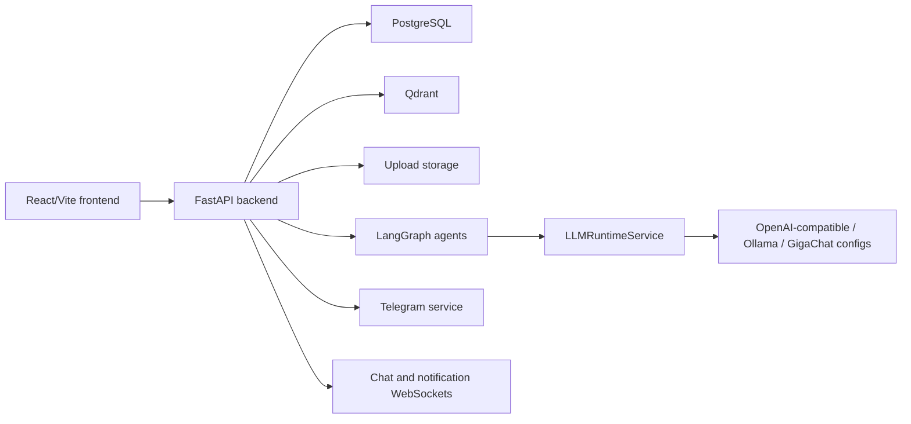
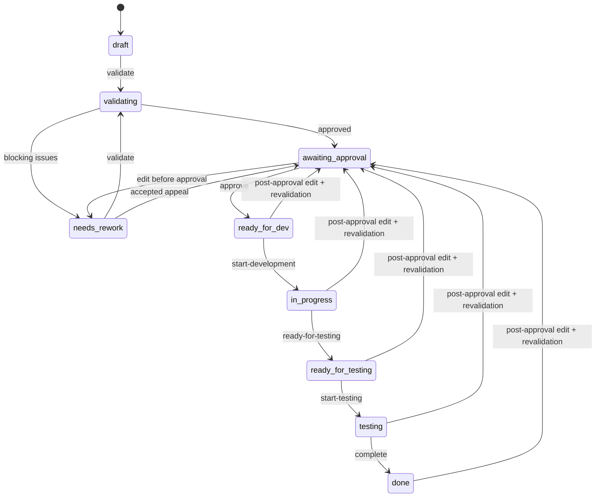
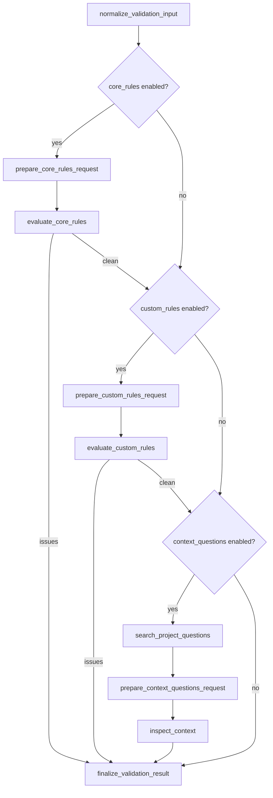
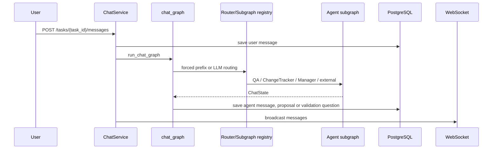
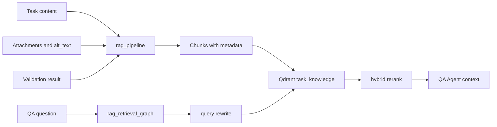

# Дизайн текущей системы

## Обзор

Система состоит из React SPA и FastAPI API. PostgreSQL используется как persistence store, Qdrant хранит semantic project/task memory, а LangGraph оркестрирует LLM-workflows для валидации, chat routing, QA, change tracking, RAG indexing/retrieval, provider tests и evaluation helpers.

## Поток запроса и аутентификация

- Публичные backend routes: `/healthz`, `/readyz`, auth register/login/refresh/logout и Telegram webhook.
- Защищенные API зависят от `CurrentUser`, который декодирует bearer JWT и отклоняет отсутствующих, некорректных, неактивных или soft-deleted пользователей.
- Refresh tokens являются случайными server-side tokens, которые хэшируются и сохраняются в `refresh_tokens`; raw token хранится в HTTP-only cookie.
- Refresh выполняет token rotation. Повторное использование revoked refresh token отзывает всю token family.
- Frontend хранит access token в Zustand и использует Axios interceptors для добавления `Authorization: Bearer ...`. Параллельные 401 retries ожидают один refresh request.

## Сводка доменной модели

| Агрегат | Таблицы / модели | Примечания |
| --- | --- | --- |
| Пользователи и сессии | `users`, `refresh_tokens` | Глобальная роль, active state, soft delete marker, notification preferences. |
| Проекты | `projects`, `project_members`, `custom_rules` | Project manager rights хранятся как membership roles; validation node settings находятся на project. |
| Теги задач | `task_tags`, `project_task_tags` | Global dictionary плюс project directory. |
| Задачи | `tasks`, `task_attachments` | Task content, tags, workflow status, assigned roles, validation JSON и RAG sync timestamp. |
| Чат и предложения | `messages`, `change_proposals`, `validation_questions` | Agent replies и source refs хранятся как messages; proposals являются reviewable artifacts. |
| Уведомления | `notifications`, `notification_deliveries`, `telegram_connections`, `telegram_link_tokens`, `chat_read_states` | In-app delivery выполняется сразу; Telegram delivery зависит от user settings и connection. |
| LLM runtime | `llm_provider_configs`, `llm_runtime_settings`, `llm_agent_overrides`, `llm_agent_prompt_configs`, `llm_agent_prompt_versions`, `llm_request_logs` | Admin-managed providers, prompts, overrides и request observability. |
| Мониторинг | `audit_events`, `graph_run_logs`, `graph_run_events` | Audit и graph traces питают admin views. |
| Eval suites | `rag_eval_*`, `orchestrator_eval_*`, `adaptation_eval_*`, `validation_eval_*`, `qure_eval_*` | Admin datasets, runs, results и exports. |

## Жизненный цикл задачи

Детали реализации:

- Pre-approval editable statuses: `draft`, `needs_rework`, `awaiting_approval`.
- Post-approval editable statuses: `ready_for_dev`, `in_progress`, `ready_for_testing`, `testing`, `done`.
- Post-approval edits выставляют `requires_revalidation` и могут делать embeddings stale; перед повторной валидацией при stale embeddings требуется explicit commit.
- Chat access всегда есть у admins, task analyst и reviewer analyst. Developer/tester получают chat access, когда задача достигает team-chat statuses: `ready_for_dev`, `in_progress`, `ready_for_testing`, `testing`, `done`.

## Поверхность API

Backend routers смонтированы без code-level `/api` prefix. В production-like frontend deployment nginx проксирует `/api` на backend. Подробный перечень endpoints находится в `api-contract.md`.

Основные группы routers:

- `auth`: registration, login, refresh, logout, current user, sessions.
- `users`: profile, avatar и admin user management.
- `projects`: project CRUD, members и custom rules.
- `tasks`: task CRUD, workflow actions, attachments и tag suggestions.
- `validation`: task validation.
- `chat`: task messages и WebSocket.
- `proposals`: proposal listing и review.
- `task-tags`: project tag directory.
- `notifications` и `telegram`: notifications, chat unread state и Telegram integration.
- `admin`: LLM runtime, monitoring, Qdrant diagnostics, eval suites, audit, validation backlog и task tag admin.

## Карта маршрутов фронтенда

| Route | Доступ | Страница |
| --- | --- | --- |
| `/` | Публичный | Landing page |
| `/login`, `/register` | Публичный | Страницы аутентификации |
| `/profile` | Авторизованный пользователь | Профиль |
| `/notifications` | Авторизованный пользователь | Центр уведомлений |
| `/projects` | Авторизованный пользователь | Список проектов |
| `/projects/:projectId/tasks` | Доступ к проекту | Список задач |
| `/projects/:projectId/tasks/new` | Доступ к проекту | Создание задачи |
| `/projects/:projectId/tasks/:taskId` | Доступ к задаче | Детали/workspace задачи |
| `/projects/:projectId/tasks/:taskId/chat` | Доступ к чату задачи | Чат задачи |
| `/admin/*` | Только `ADMIN` | Monitoring, graph runs, Qdrant, evals, LLM runtime, prompts, users, tags, rules |

## Граф валидации

Graph возвращает `approved` или `needs_rework`, issues, questions и metadata. Task service сохраняет результат и переводит task status.

## Поток чата и агентов

Chat artifacts используют `source_ref` для прозрачности routing, provider/model details, RAG sources и error metadata, когда они доступны.

## RAG-пайплайн и извлечение контекста

Qdrant collections, которые сейчас использует agentic layer:

- `task_knowledge`: task text, validation, attachments и cross-task context.
- `project_questions`: reusable validation questions для project context checks.
- `task_proposals`: change proposal memory и duplicate checks.

## Наблюдаемость

- `AuditService` записывает business events, такие как auth, project, task и admin changes.
- `LLMRuntimeService` записывает LLM request payload и response metadata в `llm_request_logs`.
- `graph_run_tracing` записывает graph runs и node events, когда graph monitoring включен.
- Admin pages предоставляют monitoring summaries, activity metrics, LLM request logs, graph run lists/details и audit events.

## Отказы и защитные проверки

- Отсутствующий или некорректный bearer token возвращает `401`; недостаточная role/project rights возвращает `403`.
- Отсутствующие domain entities возвращают `404`; некорректные workflow actions возвращают `422` или `400` в зависимости от handler.
- Refresh token reuse отзывает token family и удаляет refresh cookie.
- Qdrant, LLM и Vision failures обрабатываются service-specific fallbacks там, где они реализованы; diagnostics доступны через admin endpoints и logs.
- Attachment paths resolve внутри `UPLOAD_DIR`; файлы вне upload root считаются отсутствующими.
- Ошибки graph export логируются при startup и не блокируют application lifespan.
