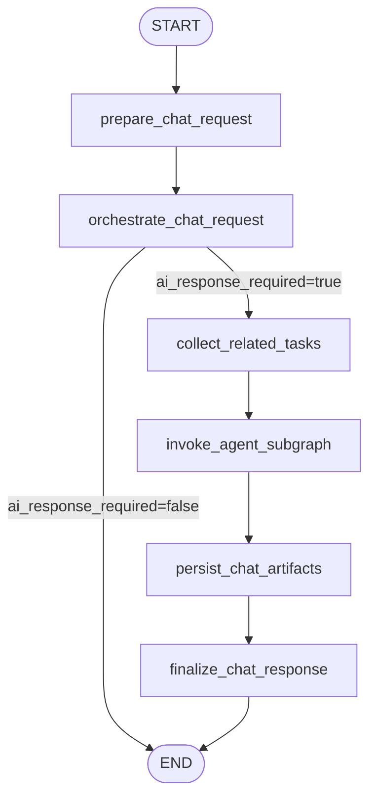
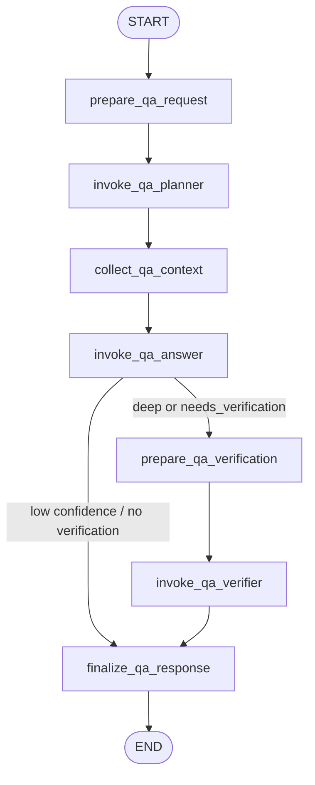
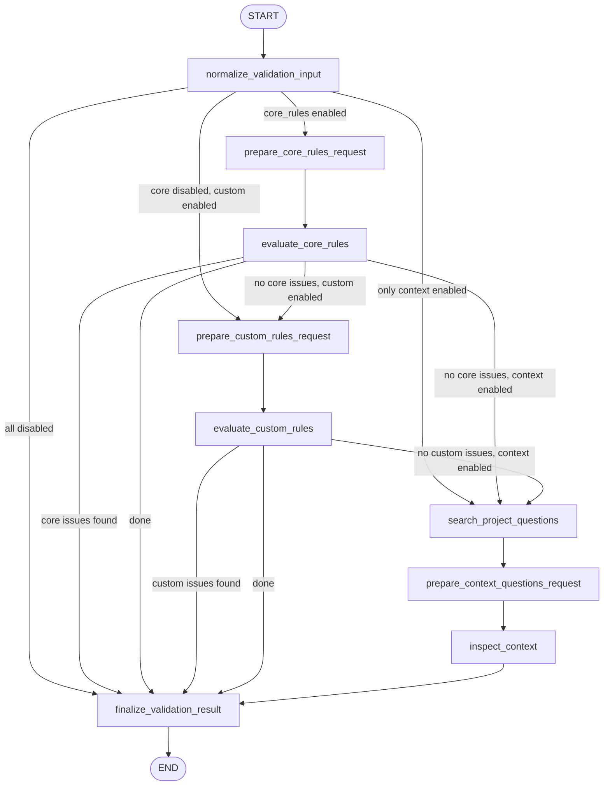
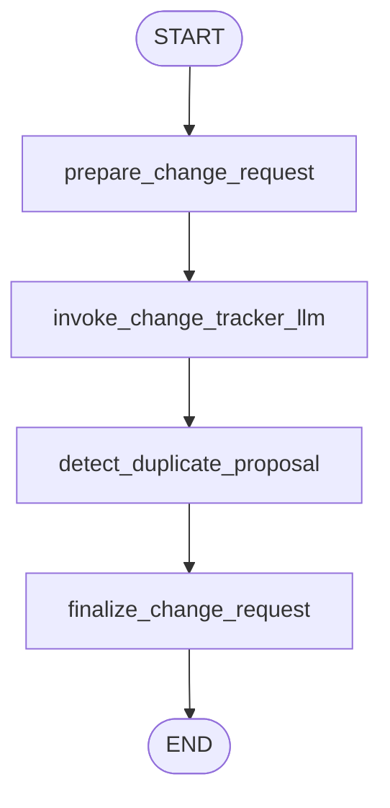
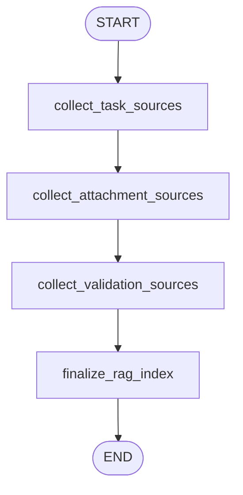
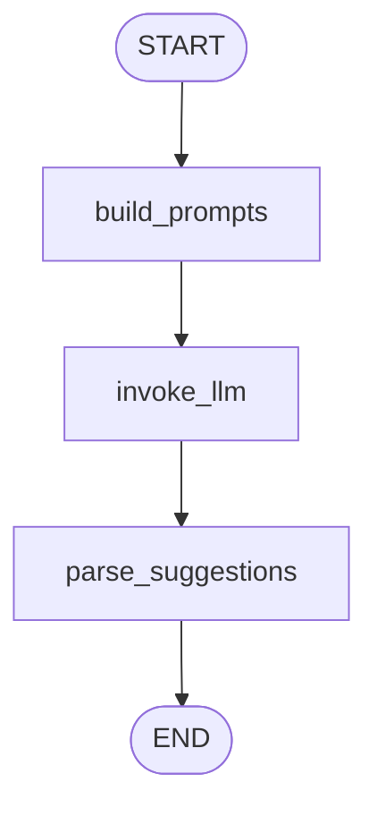
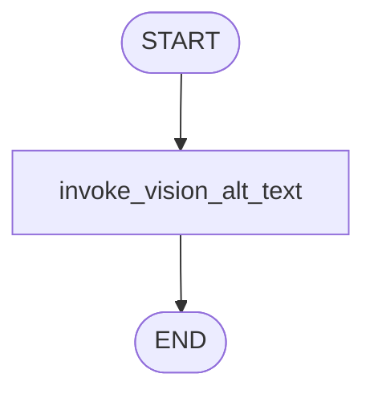
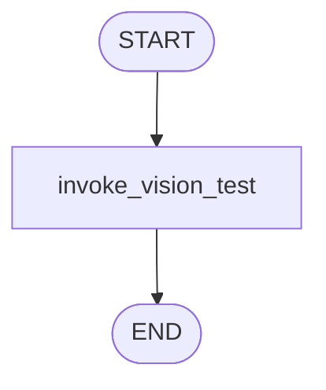
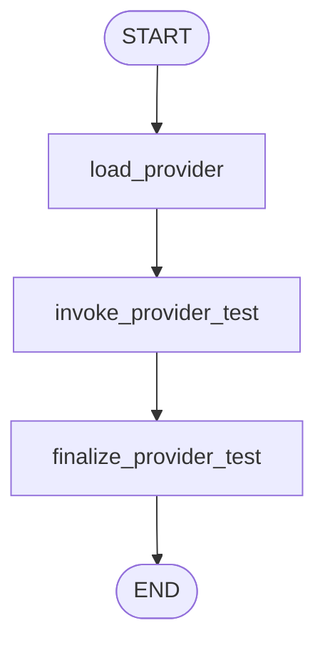
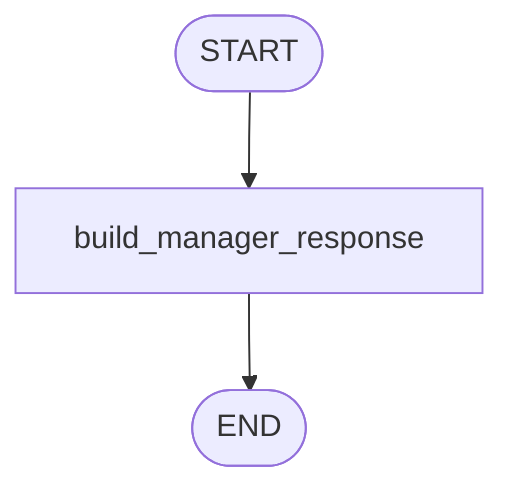

# Документация по LangGraph-графам системы

Источник истины: код в `backend/app/agents` и точки вызова в сервисах backend. Документ описывает фактическую реализацию графов, а не целевую архитектурную гипотезу.

Все русскоязычные строки должны храниться в UTF-8. При обновлении документации проверяйте, что текст не превратился в mojibake вида `РџСЂРё...`.

## Общая модель agentic-слоя

Взаимодействие с ИИ в проекте идет через LangGraph и централизованный `LLMRuntimeService`. Графы не создают клиентов OpenAI, Ollama, OpenRouter, GigaChat или OpenAI-compatible API напрямую. Вместо этого они передают `agent_key`, `prompt_key`, контекст пользователя/задачи/проекта и системный/пользовательский prompt в runtime-слой.

Ключевые файлы:

| Файл | Роль |
| --- | --- |
| `backend/app/agents/chat_graph.py` | Верхнеуровневая маршрутизация сообщений чата и запуск agent subgraph |
| `backend/app/agents/subgraph_registry.py` | Реестр встроенных и внешних subgraphs |
| `backend/app/agents/qa_agent_graph.py` | Ответы на вопросы по задаче с planner/answer/verifier стадиями |
| `backend/app/agents/change_tracker_agent_graph.py` | Преобразование сообщения в предложение изменения |
| `backend/app/agents/validation_graph.py` | Автоматическая проверка требования |
| `backend/app/agents/rag_pipeline.py` | Подготовка chunks для Qdrant |
| `backend/app/agents/attachment_vision_graph.py` | Alt-text для изображений вложений |
| `backend/app/agents/task_tag_suggestion_graph.py` | Подбор тегов задачи |
| `backend/app/agents/provider_test_graph.py` | Проверка LLM-провайдера |
| `backend/app/agents/vision_test_graph.py` | Админская проверка Vision-провайдера |
| `backend/app/agents/manager_agent_graph.py` | Fallback-ответы по маршрутизации |

Графы экспортируются в PNG/HTML через `backend/app/agents/graph_export.py`. Текущий каталог экспорта: `langgraph_graphs`.

## Сложные графы

Сложными считаются графы, которые управляют несколькими стадиями бизнес-процесса, обращаются к LLM/Qdrant/БД, имеют условные переходы или сохраняют побочные артефакты.

### Chat Graph

Файл: `backend/app/agents/chat_graph.py`

Назначение: оркестрирует обработку пользовательского сообщения в чате задачи. Сам граф не является предметным агентом. Он нормализует сообщение, выбирает нужный agent subgraph, собирает RAG-контекст похожих задач, запускает subgraph и сохраняет связанные артефакты.

Точка входа: `ChatService.process_pending_response(...)` после того, как `ChatService.send_message(...)` уже сохранил пользовательское сообщение.

Входное состояние:

| Поле | Назначение |
| --- | --- |
| `db` | Async SQLAlchemy-сессия для чтения задачи и сохранения артефактов |
| `task_id`, `project_id` | Контекст задачи и проекта |
| `actor_user_id` | Пользователь, отправивший сообщение |
| `source_message_id` | ID исходного пользовательского сообщения |
| `task_title`, `task_status`, `task_content` | Контекст текущей задачи |
| `message_type` | Предварительный тип: `general`, `question`, `change_proposal` |
| `message_content` | Сообщение без forced-routing префикса |
| `raw_message_content` | Исходная строка пользователя |
| `validation_result` | Последний результат проверки требования |
| `related_tasks` | Уже найденные похожие задачи, если переданы вызывающим кодом |
| `requested_agent` | Явно выбранный агент из `@qa`, `/qaagent`, `@change-tracker` и т.п. |

Выходное состояние:

| Поле | Назначение |
| --- | --- |
| `ai_response_required` | Нужно ли сохранять ответ агента в чат |
| `agent_name` | Отображаемое имя агента |
| `message_type` | Тип агентного сообщения: чаще `agent_answer` или `agent_proposal` |
| `response` | Текст ответа для сообщения в чате |
| `source_ref` | Метаданные источника, маршрутизации, LLM и сохраненных артефактов |
| `proposal_text` | Текст предложения изменения, если subgraph его сформировал |

Схема:



Узлы:

| Узел | Что делает |
| --- | --- |
| `prepare_chat_request` | Обрезает пробелы в `message_content`, сохраняет исходный текст в `raw_message_content` |
| `orchestrate_chat_request` | Обрабатывает forced routing или вызывает auto-selection через `subgraph_registry` |
| `collect_related_tasks` | Если `related_tasks` не переданы, ищет до 3 похожих задач через `RagService.search_related_tasks` |
| `invoke_agent_subgraph` | Находит subgraph по `target_agent_key`, запускает его через `run_agent_subgraph` |
| `persist_chat_artifacts` | Сохраняет change proposal или validation backlog question, дополняет `source_ref` |
| `finalize_chat_response` | Оставляет только публичные поля финального состояния |

Маршрутизация:

| Сценарий | Решение |
| --- | --- |
| Есть `requested_agent`, ключ найден | `routing_mode=forced`, запуск выбранного subgraph |
| Есть `requested_agent`, ключ не найден | `routing_mode=forced`, fallback в `ManagerAgent` |
| Forced routing отсутствует | `subgraph_registry.select_agent_subgraph(context)` проверяет auto-routable subgraphs по приоритету |
| Ни один subgraph не подходит | `ai_response_required=false`, граф завершается без агентного сообщения |

Встроенные auto-routing правила:

| Агент | Условие |
| --- | --- |
| `QAAgent` | `message_type == "question"` и вопрос признан относящимся к задаче |
| `ChangeTrackerAgent` | `message_type == "change_proposal"` |
| `ManagerAgent` | Не auto-routable; используется как fallback |

Побочные эффекты:

| Условие | Эффект |
| --- | --- |
| `proposal_text` есть или `message_type == "agent_proposal"` | `ProposalService.create_from_message(...)` создает запись в `change_proposals` |
| `source_ref.duplicate_proposal == true` | Новый proposal не сохраняется |
| `source_ref.validation_backlog_question` содержит вопрос | `ValidationQuestionService.record_chat_question(...)` сохраняет вопрос для будущей валидации |
| Пользователь известен | `AuditService.record(...)` пишет audit-событие по proposal или validation question |

Деградация и ошибки:

| Ситуация | Поведение |
| --- | --- |
| Нет `db` или `task_id` на стадии сохранения | Граф возвращает ответ без сохранения дополнительных артефактов |
| Выбранный subgraph не найден | Повторная попытка найти `ManagerAgent`; если его нет, `RuntimeError` |
| Вопрос не связан с задачей | Граф завершает обработку без агентного ответа |

Что важно тестировать:

- forced routing по ключам и aliases;
- unknown forced agent и fallback-сообщение;
- auto-routing вопроса в QA только при релевантности задаче;
- auto-routing change proposal в ChangeTracker;
- сохранение proposal и validation backlog question;
- отсутствие AI-ответа для фоновых сообщений.

### QA Agent Graph

Файл: `backend/app/agents/qa_agent_graph.py`

Назначение: отвечает на вопросы по задаче. Граф разделяет работу на planning, retrieval, answer и optional verification. Это снижает риск ответа без контекста и позволяет сохранять неуверенные вопросы в backlog валидации.

Точка входа: `chat_graph` через `subgraph_registry`, а также legacy wrapper в `backend/app/agents/chat_agents/question_agent.py`.

Входное состояние:

| Поле | Назначение |
| --- | --- |
| `db` | Нужна для LLM runtime и Qdrant |
| `actor_user_id`, `task_id`, `project_id` | Контекст логирования и поиска |
| `task_title`, `task_status`, `task_content` | Базовый контекст задачи |
| `message_content` | Вопрос пользователя |
| `validation_result` | Последний verdict, issues и questions |
| `related_tasks` | Похожие задачи, собранные `chat_graph` |
| `routing_mode` | `auto` или `forced` |

Схема:



Узлы:

| Узел | Что делает |
| --- | --- |
| `prepare_qa_request` | Собирает prompt для planner: задача, вопрос, validation result, похожие задачи |
| `invoke_qa_planner` | Вызывает LLM с `agent_key=qa-planner`; получает режим анализа и параметры retrieval |
| `collect_qa_context` | При `needs_rag=true` ищет chunks в `task_knowledge` через `QdrantService.search_task_knowledge` |
| `invoke_qa_answer` | Вызывает LLM с `agent_key=qa-answer`; ожидает JSON с ответом и confidence |
| `prepare_qa_verification` | Собирает prompt для проверки draft answer на groundedness |
| `invoke_qa_verifier` | Вызывает LLM с `agent_key=qa-verifier` |
| `finalize_qa_response` | Выбирает финальный ответ, confidence, source_ref и backlog question |

Planner contract:

| Поле JSON | Роль |
| --- | --- |
| `analysis_mode` | `direct` или `deep`; неизвестные значения нормализуются в `direct` |
| `needs_rag` | Нужно ли искать chunks в Qdrant |
| `needs_verification` | Нужно ли запускать verifier после answer |
| `retrieval_query` | Запрос для `task_knowledge` |
| `retrieval_limit` | Лимит от 1 до 6; fallback 4 для `deep`, 2 для `direct` |
| `focus_points` | Список фокусов анализа |
| `canonical_question_hint` | Нормализованный вопрос для возможного backlog |

Answer contract:

| Поле JSON | Роль |
| --- | --- |
| `answer` | Текст ответа |
| `confidence` | `high` или `low`; также выводится эвристически по маркерам неопределенности |
| `canonical_question` | Вопрос, который нужно сохранить, если confidence низкая |

Verifier contract:

| Поле JSON | Роль |
| --- | --- |
| `final_answer` | Исправленный или подтвержденный ответ |
| `confidence` | Итоговая уверенность |
| `canonical_question` | Вопрос для backlog при низкой уверенности |

Условные переходы:

| После `invoke_qa_answer` | Следующий узел |
| --- | --- |
| LLM answer неуспешен или JSON не распарсен | `finalize_qa_response` |
| Confidence низкая | `finalize_qa_response` |
| `needs_verification=true` или `analysis_mode=deep` | `prepare_qa_verification` |
| Иначе | `finalize_qa_response` |

Source metadata:

| Поле | Смысл |
| --- | --- |
| `collection` | `task_knowledge`, если есть chunk IDs, иначе `tasks` |
| `answer_confidence` | Итоговая уверенность |
| `analysis_mode` | Режим planner |
| `focus_points` | Фокусы анализа |
| `validation_backlog_question` | Вопрос для сохранения через `chat_graph` |
| `chunk_ids` | RAG chunks, использованные в ответе |
| `related_task_ids` | ID похожих задач |
| `llm_stages` | Provider/model/ok по planner, answer и verifier |
| `agent_key`, `agent_description`, `routing_mode` | Данные маршрутизации и справочника агентов |

Деградация:

| Ситуация | Поведение |
| --- | --- |
| `db is None` на planner | Planner не вызывает LLM, но включает RAG по умолчанию и строит прямой fallback |
| `qa-answer` недоступен | Формируется резервное резюме из задачи, validation result, RAG и похожих задач |
| Confidence низкая | Ответ дополняется фразой о сохранении вопроса в базе вопросов |
| Verifier недоступен | Используется ответ answer-стадии без verifier-исправления |

Что важно тестировать:

- `direct` и `deep` режимы;
- нормализацию `retrieval_limit`;
- включение/выключение RAG;
- сохранение `validation_backlog_question` при низкой confidence;
- fallback при недоступной LLM;
- корректное заполнение `llm_stages`.

### Validation Graph

Файл: `backend/app/agents/validation_graph.py`

Назначение: проверяет качество требования перед переводом задачи в `awaiting_approval` или `needs_rework`. Граф выполняет базовую проверку, кастомные правила проекта и контекстные вопросы из Qdrant. Стадии могут отключаться настройками проекта.

Точка входа: `TaskService.validate_task(...)`.

Входное состояние:

| Поле | Назначение |
| --- | --- |
| `db` | Для LLM runtime; если отсутствует, используются fallback-эвристики |
| `actor_user_id`, `task_id`, `project_id` | Контекст логирования и поиска |
| `title`, `content` | Проверяемое требование |
| `tags` | Теги задачи |
| `custom_rules` | Активные проектные правила, применимые к тегам |
| `related_tasks` | Похожие задачи из RAG |
| `attachment_names` | Имена вложений задачи |
| `validation_node_settings` | Включение/выключение `core_rules`, `custom_rules`, `context_questions` |

Схема:



Узлы:

| Узел | Что делает |
| --- | --- |
| `normalize_validation_input` | Обрезает title/content, собирает `lower_text`, нормализует настройки узлов |
| `prepare_core_rules_request` | Формирует prompt базовой проверки требования |
| `evaluate_core_rules` | Вызывает LLM `task-validation`; при сбое использует fallback core-анализ |
| `prepare_custom_rules_request` | Формирует prompt с активными правилами проекта |
| `evaluate_custom_rules` | Проверяет custom rules через LLM или fallback по ключевым словам правил |
| `search_project_questions` | Ищет исторические вопросы проекта в `project_questions` |
| `prepare_context_questions_request` | Формирует prompt контекстного анализа |
| `inspect_context` | Генерирует уточняющие вопросы с учетом вложений, похожих задач и RAG-вопросов |
| `finalize_validation_result` | Собирает `issues`, `questions`, `verdict` |

LLM contracts:

| Стадия | Ожидаемый JSON |
| --- | --- |
| Core rules | `{"issues":[{"code":"...","severity":"low|medium|high","message":"..."}],"questions":["..."]}` |
| Custom rules | `{"issues":[...]}` |
| Context questions | `{"questions":["..."]}` |

Условные переходы:

| Условие | Поведение |
| --- | --- |
| Все validation nodes отключены | Сразу `approved`, без issues/questions |
| Core rules включены и нашли issues | Граф завершает проверку без custom/context стадий |
| Custom rules включены и нашли issues | Граф завершает проверку без context stage |
| Issues нет | Граф идет дальше по включенным стадиям |
| Context stage включена | Qdrant questions добавляются к вопросам LLM и дедуплицируются |

Fallback-логика:

| Проверка | Правило |
| --- | --- |
| `title_too_short` | Название короче 8 символов |
| `content_too_short` | Описание короче 80 символов |
| `ambiguous_language` | Найдены маркеры вроде `быстро`, `удобно`, `примерно`, `как обычно` |
| Missing acceptance language | Нет признаков критериев приемки: `должен`, `should`, `must`, `если`, `when`, `then`, `критер` |
| Custom rules fallback | Ключевые слова правила не встречаются в тексте требования |
| Context fallback | Нет тегов, нет вложений при упоминании макета/схемы/UI, есть похожие задачи, есть RAG-вопросы |

Выход:

| Поле | Значение |
| --- | --- |
| `verdict` | `approved`, если нет issues; иначе `needs_rework` |
| `issues` | Core/custom issues с `code`, `severity`, `message` |
| `questions` | Core questions и context questions, дедуплицированные |

Побочные эффекты выполняет вызывающий сервис, не сам граф:

| Сервис | Эффект |
| --- | --- |
| `TaskService.validate_task` | Сохраняет `tasks.validation_result`, переводит статус задачи |
| `RagService.index_task_context` | Переиндексирует задачу с учетом результата валидации |
| `Message` creation | Добавляет агентное сообщение с итогом проверки в чат |
| `AuditService.record` | Пишет `task.validated` |

Что важно тестировать:

- отключение всех стадий через `validation_node_settings`;
- early stop после core issues;
- early stop после custom rule issues;
- проход до context stage только при чистых core/custom проверках;
- дедупликацию Qdrant-вопросов;
- fallback без `db`.

### ChangeTracker Agent Graph

Файл: `backend/app/agents/change_tracker_agent_graph.py`

Назначение: преобразует сообщение пользователя в отслеживаемое предложение изменения требования. Граф извлекает нормализованный `proposal_text`, проверяет дубли в Qdrant и возвращает либо `agent_proposal`, либо информационный `agent_answer` при дубле.

Точка входа: `chat_graph` через `subgraph_registry`, а также legacy wrapper в `backend/app/agents/chat_agents/change_tracker_agent.py`.

Входное состояние:

| Поле | Назначение |
| --- | --- |
| `db` | Для LLM runtime |
| `actor_user_id`, `task_id`, `project_id` | Контекст аудита и поиска дублей |
| `task_title`, `task_status`, `task_content` | Контекст задачи |
| `message_content` | Сырой запрос изменения |
| `routing_mode` | `auto` или `forced` |

Схема:



Узлы:

| Узел | Что делает |
| --- | --- |
| `prepare_change_request` | Формирует prompt из контекста задачи и requested change |
| `invoke_change_tracker_llm` | Вызывает LLM с `agent_key=change-tracker` |
| `detect_duplicate_proposal` | Парсит `proposal_text` из JSON и ищет дубли через `QdrantService.find_duplicate_proposal` |
| `finalize_change_request` | Формирует финальный ответ и `source_ref` |

LLM contract:

```json
{
  "proposal_text": "Нормализованный текст изменения",
  "acknowledgement": "Короткое подтверждение для пользователя"
}
```

Деградация:

| Ситуация | Поведение |
| --- | --- |
| `db is None` или LLM недоступна | Используется исходный `message_content` как `proposal_text` и fallback acknowledgement |
| LLM вернула не JSON | Используется fallback acknowledgement и исходный текст |
| Нет `project_id` | Проверка дублей пропускается |
| Найден дубль | Возвращается `message_type=agent_answer`, `duplicate_proposal=true`, новый proposal не сохраняется |

Source metadata:

| Поле | Смысл |
| --- | --- |
| `collection` | `task_proposals` |
| `provider_kind`, `model` | Провайдер и модель, если LLM была успешна |
| `fallback` | `true`, если результат без успешной LLM |
| `duplicate_proposal` | Признак найденного дубля |
| `duplicate_task_id`, `duplicate_proposal_id` | Ссылки на похожее предложение |
| `agent_key`, `agent_description`, `routing_mode` | Справочник агента и маршрут |

Побочные эффекты:

Сам граф не пишет `change_proposals`. Он возвращает `proposal_text`. Сохранение выполняет `chat_graph.persist_chat_artifacts`, если proposal не дубль.

Что важно тестировать:

- forced routing обычного сообщения в ChangeTracker;
- auto-routing `change_proposal`;
- JSON parse успешного LLM-ответа;
- fallback при недоступной LLM;
- обнаружение дубля и запрет сохранения нового proposal.

### RAG Pipeline

Файл: `backend/app/agents/rag_pipeline.py`

Назначение: превращает контекст задачи в список chunks для Qdrant-коллекции `task_knowledge`. Граф не пишет в Qdrant напрямую. Он только строит нормализованные chunks; запись выполняет `RagService.index_task_context(...)` и `QdrantService`.

Точка входа: `RagService.index_task_context(...)`. Косвенно вызывается при создании/обновлении/commit/валидации задачи и при изменении вложений.

Входное состояние:

| Поле | Назначение |
| --- | --- |
| `task_id` | Основа для стабильных `chunk_id` |
| `title`, `content` | Текст задачи |
| `tags` | Теги задачи |
| `attachments` | Метаданные, извлеченный текст и alt-text вложений |
| `validation_result` | Последний результат валидации |

Схема:



Узлы:

| Узел | Что делает |
| --- | --- |
| `collect_task_sources` | Создает источники `task_title`, `task_content`, `task_tags` |
| `collect_attachment_sources` | Создает источники по вложениям: image alt-text, extracted text или metadata fallback |
| `collect_validation_sources` | Добавляет JSON-контекст verdict/issues/questions |
| `finalize_rag_index` | Делит источники на chunks с overlap и формирует стабильные метаданные |

Источники chunks:

| `source_type` | Когда создается |
| --- | --- |
| `task_title` | Всегда |
| `task_content` | Всегда |
| `task_tags` | Если есть теги |
| `attachment_image_alt_text` | Если вложение является изображением и есть `alt_text` |
| `attachment_text` | Если есть извлеченный текст вложения |
| `attachment_metadata` | Если содержимое вложения не извлечено |
| `validation_result` | Если есть `validation_result` |

Chunk ID:

```text
{task_id}:{source_type}:{source_id}:{chunk_index}
```

Параметры chunking:

| Настройка | Назначение |
| --- | --- |
| `RAG_CHUNK_TARGET_TOKENS` | Целевой размер chunk в токенах-словах |
| `RAG_CHUNK_OVERLAP_TOKENS` | Перекрытие между соседними chunks |

Поведение split:

| Ситуация | Результат |
| --- | --- |
| Текст пустой или whitespace | Chunks не создаются |
| Текст короче target | Один chunk |
| Текст длиннее target | Последовательность chunks со сдвигом `target - overlap` |
| `overlap >= target` | Overlap ограничивается `target - 1` |

Выход:

| Поле | Назначение |
| --- | --- |
| `indexed` | `true`, если граф завершил подготовку |
| `chunk_ids` | Список ID всех chunks |
| `chunks` | Полные payloads для записи в Qdrant |

Что важно тестировать:

- стабильность `chunk_id`;
- overlap для длинного текста;
- сохранение UTF-8 и CP1251-текста после извлечения вложений;
- попадание `alt_text` изображений в `attachment_image_alt_text`;
- добавление validation result после проверки задачи.

## Остальные графы

Эти графы линейные, но остаются частью agentic-слоя и должны также поддерживаться через LangGraph.

### Task Tag Suggestion Graph

Файл: `backend/app/agents/task_tag_suggestion_graph.py`

Назначение: предлагает до 5 тегов из справочника проекта. Граф не имеет права придумывать новые теги.

Схема:



Контракт LLM:

```json
{
  "suggestions": [
    {"tag": "backend", "confidence": 0.87, "reason": "Почему тег подходит"}
  ]
}
```

Валидация результата:

| Правило | Поведение |
| --- | --- |
| Тег не входит в `available_tags` | Отбрасывается |
| Confidence ниже `0.8` | Отбрасывается |
| Нет `reason` | Отбрасывается |
| Повтор тега | Отбрасывается |
| Больше 5 валидных тегов | Берутся первые 5 |
| `reason` длиннее 300 символов | Обрезается до 300 |

Ошибки: если LLM недоступна или вернула пустой ответ, граф выбрасывает `RuntimeError`, который сервис преобразует в HTTP 503.

### Attachment Vision Graph

Файл: `backend/app/agents/attachment_vision_graph.py`

Назначение: генерирует `alt_text` для изображений во вложениях, чтобы визуальный контент попадал в RAG.

Схема:



Вход: `db`, `actor_user_id`, `task_id`, `project_id`, `image_bytes`, `content_type`, `prompt`.

Выход: `task_id`, `project_id`, `alt_text`.

Деградация:

| Ситуация | Поведение |
| --- | --- |
| Нет `db` или нет `image_bytes` | `alt_text=None` |
| Vision runtime вернул ошибку | `alt_text=None` |
| Vision runtime вернул пустой текст | `alt_text=None` |

### Vision Test Graph

Файл: `backend/app/agents/vision_test_graph.py`

Назначение: админская проверка Vision-провайдера из `/admin/vision-test` и endpoint `POST /admin/llm/vision-test`.

Схема:



Выход:

| Поле | Назначение |
| --- | --- |
| `ok` | Успешность проверки |
| `provider_config_id`, `provider_kind`, `provider_name` | Использованный Vision-провайдер |
| `model` | Модель |
| `latency_ms` | Время ответа |
| `result_text` | Извлеченный текст или ответ модели |
| `message` | Ошибка или текст ответа |
| `prompt`, `content_type` | Echo входных параметров |

Если изображение не передано, граф возвращает `ok=false` и сообщение `Изображение не передано.`

### Provider Test Graph

Файл: `backend/app/agents/provider_test_graph.py`

Назначение: проверяет конкретный LLM provider config из админки перед использованием в runtime.

Схема:



Узлы:

| Узел | Что делает |
| --- | --- |
| `load_provider` | Загружает `LLMProviderConfig`, возвращает `provider_kind` и `model` |
| `invoke_provider_test` | Вызывает `LLMRuntimeService.test_provider(...)` |
| `finalize_provider_test` | Формирует публичный result |

Ошибки:

| Ситуация | HTTPException |
| --- | --- |
| Нет `db` или `provider_id` | 500 `Контекст проверки провайдера не инициализирован` |
| Provider config не найден | 404 `Профиль провайдера не найден` |

### Manager Agent Graph

Файл: `backend/app/agents/manager_agent_graph.py`

Назначение: fallback subgraph для случаев, когда агент не выбран, forced agent неизвестен или пользователю нужно объяснить доступные маршруты.

Схема:



Поведение:

| Сценарий | Ответ |
| --- | --- |
| Forced agent неизвестен | Сообщает, что agent не зарегистрирован, и перечисляет доступные agent keys |
| Forced routing на manager/router/default | Возвращает инструктивный fallback |
| Auto/fallback без requested agent | Сообщает, что сообщение сохранено, и предлагает `@qa` или `@change-tracker` |

`ManagerAgent` зарегистрирован в `subgraph_registry` с `auto_routable=False`, поэтому он не перехватывает обычные сообщения сам.

## Реестр subgraphs

Файл: `backend/app/agents/subgraph_registry.py`

`subgraph_registry` не является LangGraph-графом, но он определяет, какие subgraphs доступны `chat_graph`.

Основные структуры:

| Структура | Назначение |
| --- | --- |
| `AgentSubgraphSpec` | Metadata, runner, optional `can_handle`, optional `graph_factory`, priority |
| `register_agent_subgraph(...)` | Регистрирует built-in или внешний subgraph |
| `find_agent_subgraph(key)` | Ищет по key или alias |
| `select_agent_subgraph(context)` | Последовательно вызывает `can_handle` у auto-routable subgraphs |
| `run_agent_subgraph(...)` | Запускает runner и дополняет `source_ref` описанием агента |
| `get_exportable_agent_subgraphs()` | Возвращает subgraphs с `graph_factory` для PNG/HTML экспорта |

Built-in subgraphs:

| Key | Name | Priority | Auto-routing |
| --- | --- | --- | --- |
| `qa` | `QAAgent` | 20 | Вопросы, относящиеся к задаче |
| `change-tracker` | `ChangeTrackerAgent` | 30 | Предложения изменений |
| `manager` | `ManagerAgent` | 1000 | Нет, только fallback/forced |

Внешние subgraphs подключаются через `CHAT_AGENT_MODULES`. Модуль импортируется при первом обращении к registry и должен вызвать `register_agent_subgraph(...)`.

Минимальный контракт внешнего subgraph:

```python
from app.agents.chat_agents.base import ChatAgentContext, ChatAgentMetadata
from app.agents.state import ChatState
from app.agents.subgraph_registry import AgentSubgraphSpec, register_agent_subgraph


async def can_handle(context: ChatAgentContext) -> bool:
    return "#risk" in context.message_content.lower()


async def run_risk_agent(context: ChatAgentContext, routing_mode: str) -> ChatState:
    return {
        "agent_name": "RiskAgent",
        "message_type": "agent_answer",
        "response": "Нужно отдельно проверить риски требования.",
        "source_ref": {"collection": "messages"},
    }


register_agent_subgraph(
    AgentSubgraphSpec(
        metadata=ChatAgentMetadata(
            key="risk",
            name="RiskAgent",
            description="Анализирует риски по задаче.",
            aliases=("risk-review",),
            priority=40,
        ),
        can_handle=can_handle,
        runner=run_risk_agent,
    )
)
```

## Связь графов с бизнес-процессами

| Процесс | Графы |
| --- | --- |
| Отправка сообщения в чат | `chat_graph` -> `qa_agent_graph` / `change_tracker_agent_graph` / `manager_agent_graph` |
| Forced routing | `chat_graph` + `subgraph_registry` |
| Автоматическая проверка требования | `validation_graph` -> `rag_pipeline` |
| Индексация задачи | `attachment_vision_graph` -> `rag_pipeline` -> Qdrant |
| Вопросы по задаче | `chat_graph` -> `qa_agent_graph` -> Qdrant `task_knowledge` |
| Предложения изменений | `chat_graph` -> `change_tracker_agent_graph` -> Qdrant `task_proposals` |
| Подбор тегов | `task_tag_suggestion_graph` |
| Админская проверка провайдера | `provider_test_graph` |
| Админская проверка Vision | `vision_test_graph` |

## Qdrant-коллекции

| Коллекция | Используют |
| --- | --- |
| `task_knowledge` | `rag_pipeline`, `qa_agent_graph`, `chat_graph.collect_related_tasks` |
| `project_questions` | `validation_graph.search_project_questions` |
| `task_proposals` | `change_tracker_agent_graph.detect_duplicate_proposal` |

## LLM agent keys

| Key | Где используется |
| --- | --- |
| `chat-routing` | Проверка релевантности вопроса задаче в auto-routing |
| `qa-planner` | Планирование QA-ответа |
| `qa-answer` | Генерация QA-ответа |
| `qa-verifier` | Проверка QA-ответа |
| `change-tracker` | Извлечение proposal |
| `task-validation` | Core/custom/context validation stages |
| `task_tag_suggester` | Подбор тегов |
| `rag-vision` | Alt-text изображений вложений |

## Правила сопровождения

- При добавлении нового агентного сценария оформляйте его как LangGraph subgraph, если он взаимодействует с ИИ.
- Не обходите `LLMRuntimeService`: настройки провайдеров, overrides, prompt configs и request logs должны работать одинаково для всех графов.
- Добавляйте `agent_key`, `agent_description`, `routing_mode` в `source_ref`, если subgraph возвращает сообщение в чат.
- Для сложного графа документируйте state, узлы, conditional routing, side effects и fallback.
- Если граф должен отображаться в UI схем, добавляйте `graph_factory` в `AgentSubgraphSpec` или `graph_export.py`.
- После изменения состава узлов обновляйте этот документ и экспорт `langgraph_graphs`.
