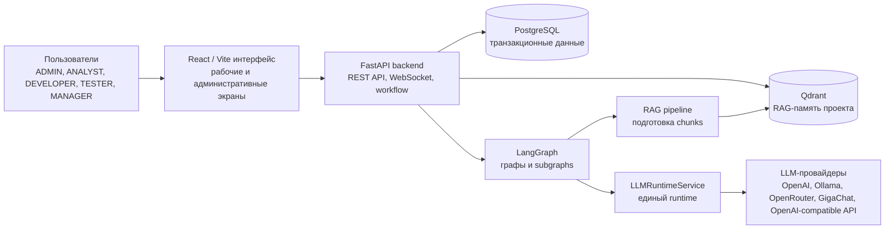
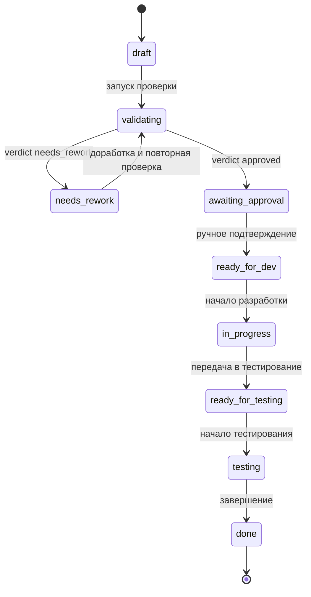
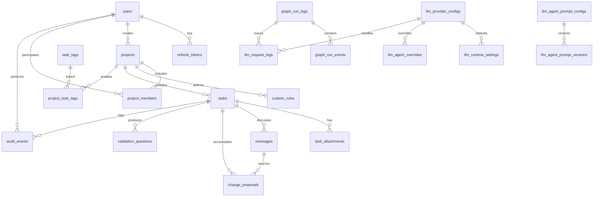

# Подробный научный план отчета по производственной практике как части магистерской работы

## Назначение документа

Этот документ задает подробную структуру будущего отчета по производственной практике. Отчет должен рассматривать практику как этап магистерской работы по разработке интеллектуальной платформы управления задачами и требованиями.

Документ является планом, а не готовым отчетом. В нем нужно фиксировать, какие разделы включить, какие научные и технические тезисы раскрыть, какие кейсы использовать, какие критерии оценки ввести и какие иллюстрации подготовить.

Ограничения:

- не включать формальные материалы: титульный лист, индивидуальное задание, дневник практики, отзыв;
- не добавлять отдельный раздел про инфраструктуру;
- не описывать систему как коммерческий стартап или самостоятельный продукт вне магистерской работы;
- все AI-взаимодействие описывать через LangGraph;
- не придумывать экспериментальные численные результаты без фактической проверки;
- русский текст сохранять в UTF-8 и проверять на корректную кодировку.

## Рекомендуемое содержание

```text
Введение
1. Проектирование системы
   1.1 Предметная область и данные
   1.2 Общая архитектура прикладного решения
   1.3 Модель данных
   1.4 Проектирование агентного слоя
   1.5 RAG-память проекта
   1.6 Методика оценки эффективности системы
   1.7 Итоговая структура решения
2. Реализация компонентов магистерской системы
   2.1 Серверная часть
   2.2 Пользовательский интерфейс
   2.3 Реализация проверки требований
   2.4 Реализация чата и агентов
   2.5 Примеры на задачах из test_task
3. Оценка результатов практики
   3.1 Технические результаты
   3.2 Критерии оценки
   3.3 Сравнение с ручным процессом
   3.4 Ограничения и угрозы валидности
Заключение
Список литературы и источников
```

## Введение

### Назначение раздела

Введение должно не просто описывать тему проекта, а задавать исследовательскую рамку магистерской работы: актуальность, проблему, объект, предмет, гипотезу, цель, задачи, методы и практическую значимость.

### Что раскрыть

- Актуальность темы магистерской работы: качество требований влияет на сроки разработки, количество уточнений, возвраты на доработку и качество итоговой реализации.
- Проблему ручной работы с требованиями: аналитик, разработчик, тестировщик и менеджер вынуждены вручную проверять полноту постановки и искать контекст в переписках, документах и старых задачах.
- Ограничение обычного трекера задач: он хранит постановки, но не помогает системно проверять качество требований и повторно использовать накопленное знание проекта.
- Идею магистерской системы: объединить управление требованиями, workflow задач, RAG-память проекта и AI-сопровождение через LangGraph.
- Производственную практику как прикладной этап магистерской работы, на котором проектируется и апробируется часть системы.

### Научный аппарат

В отчет нужно добавить следующие элементы.

| Элемент | Формулировка для раскрытия |
| --- | --- |
| Объект исследования | Процессы управления требованиями и задачами в Agile-командах |
| Предмет исследования | Методы AI-поддержки проверки требований, RAG-памяти и агентного сопровождения задач |
| Гипотеза | Использование LangGraph для управляемых AI-сценариев и RAG-памяти для сохранения проектного контекста может повысить полноту проверки требований и снизить потери знаний между участниками команды |
| Цель практики | Разработать и апробировать часть магистерской системы, отвечающую за управление требованиями, автоматическую валидацию постановок, сохранение проектного контекста и сопровождение задач AI-агентами |
| Практическая значимость | Прототипируемая часть системы применима для анализа и сопровождения сложных требований, содержащих workflow, справочники, права, вложения и зависимость от предыдущих задач |

### Методы работы

Перечислить методы, использованные в ходе практики:

- анализ предметной области управления требованиями;
- анализ примеров сложных требований из `test_task`;
- проектирование модели данных;
- проектирование workflow задачи;
- графовое моделирование AI-сценариев через LangGraph;
- проектирование RAG-контура;
- прототипирование backend и frontend компонентов;
- кейс-анализ на примерах задач из `test_task`;
- сравнительная оценка с ручным процессом проверки и сопровождения требований.

### Задачи практики

- Проанализировать предметную область управления задачами и требованиями.
- Определить пользовательские роли и жизненный цикл требования.
- Спроектировать модель данных для проектов, задач, вложений, сообщений, предложений изменений и справочников.
- Спроектировать LangGraph-сценарии для проверки требований, чата, RAG и предложений изменений.
- Реализовать серверную часть и пользовательский интерфейс.
- Разработать методику оценки применимости системы.
- Проверить применимость подхода на примерах задач из `test_task`.

## 1. Проектирование системы

### 1.1 Предметная область и данные

#### Основная идея раздела

Раздел должен раскрывать предметную область как часть научной постановки магистерской работы. Нужно показать, что система работает не просто с карточками задач, а с требованиями как управляемыми информационными объектами, которые проходят жизненный цикл от первичного описания до проверки, согласования, разработки, тестирования и завершения.

В академическом изложении важно связать раздел с научным аппаратом из введения:

- объект исследования - процессы управления требованиями и задачами в Agile-командах;
- предмет исследования - методы AI-поддержки проверки требований, RAG-памяти и агентного сопровождения задач;
- гипотеза - использование LangGraph для управляемых AI-сценариев и RAG-памяти для сохранения проектного контекста может повысить полноту проверки требований и снизить потери знаний между участниками команды.

Основная мысль раздела: предметная область требует не только хранения текста требования, но и сохранения контекста, статуса, ответственных участников, обсуждений, вложений, результатов проверки и истории изменений. Поэтому обычной модели трекера задач недостаточно: для магистерской системы необходим workflow, механизм проверки требований, RAG-память проекта и трассируемое AI-сопровождение через LangGraph.

#### Что описать

- Требование как центральный объект:
  - требование содержит неструктурированный текст постановки и структурированные атрибуты workflow;
  - требование связано с ответственными участниками, статусами, результатом автоматической проверки, вложениями и обсуждениями;
  - требование должно быть проверяемым и воспроизводимым: в отчете нужно объяснить, какие данные позволяют понять, почему требование перешло в конкретный статус.
- Пользователей системы и их роль в жизненном цикле требования:
  - `ADMIN` - администрирование пользователей, справочников, LLM runtime, Qdrant и мониторинга;
  - `ANALYST` - создание, редактирование, валидация и подтверждение требований;
  - `DEVELOPER` - ведение задачи в разработке;
  - `TESTER` - ведение задачи на тестировании;
  - `MANAGER` - участие в управленческих сценариях проекта.
- Проекты и участников проектов как границу предметного контекста. Проект объединяет требования, команду, правила проверки, справочники тегов и накопленную RAG-память.
- Вложения к задачам: документы, изображения и дополнительные материалы. Важно указать, что Vision-описания используются только при включенном контуре и доступном провайдере, поэтому не должны описываться как гарантированная функция любого запуска.
- Сообщения чата задачи. Они фиксируют коммуникацию и одновременно служат входными данными для LangGraph-сценариев: ответов на вопросы, выделения предложений изменений и пополнения вопросов валидации.
- Предложения изменений. Их нужно описывать как отдельные артефакты, позволяющие отделить обсуждение требования от управляемой корректировки постановки.
- Вопросы валидации. Они поддерживают проверку полноты требования и формируют повторно используемый банк проектного знания.
- Теги задач и проектные правила. Они позволяют учитывать локальную классификацию и предметные критерии проверки.
- Журнал действий и мониторинг. Эти данные нужны для трассируемости, анализа результата практики и дальнейшей экспериментальной оценки.

#### Академическое пояснение для текста отчета

В готовом отчете нужно подчеркнуть, что данные предметной области имеют смешанную природу. С одной стороны, система хранит формальные сущности: пользователей, проекты, статусы, роли, связи и настройки. С другой стороны, значительная часть знания представлена неструктурированным текстом: описаниями требований, сообщениями, вложениями и результатами обсуждений. Именно это обосновывает применение RAG-памяти и агентных сценариев: система должна не только фиксировать факты, но и помогать повторно использовать накопленный контекст.

Также нужно аккуратно сформулировать роль ИИ. AI-поддержка в рамках магистерской работы не заменяет аналитика, разработчика или тестировщика. Она выступает как средство предварительной проверки, поиска контекста, формирования вопросов и фиксации предложений изменений. Окончательное решение о качестве требования, принятии изменения и переходе статуса остается за участниками проекта.

#### Какие примеры из `test_task` использовать

- AISNSK-10914 и AISNSK-10916 - A10-прогресс, шаги прогресса, группы шагов и расчет прогресса.
- AISNSK-11629 - статусы рабочей документации.
- AISNSK-11662 - замечания в рабочей документации.
- AISNSK-11769 - категории статусов рабочей документации и ограничения редактирования.
- AISNSK-11848 - расширенный импорт реестра рабочей документации.
- AISNSK-11811 - выгрузка истории статусов.

#### Что подчеркнуть

Эти задачи полезны как материал для кейс-анализа, потому что содержат сложные требования: справочники, права, настройки, зависимость от предыдущих задач, расчетную логику, импорт, выгрузку и ограничения редактирования. В отчете нужно объяснить, какие свойства таких требований проверяют применимость системы:

- способность выделять сущности и связи;
- способность учитывать workflow и ограничения прав;
- способность сохранять контекст между задачами;
- способность формировать вопросы по неполным или неоднозначным условиям;
- способность отличать новую информацию от повторяющихся предложений изменений.

В отчете нужно объяснить, что `test_task` не является полноценной экспериментальной выборкой. Это набор демонстрационных кейсов для первичной апробации подхода и проверки того, как система работает со сложными постановками.

### 1.2 Общая архитектура прикладного решения

#### Основная идея раздела

Показать систему на уровне прикладных компонентов магистерской работы: пользовательский интерфейс, серверная логика, транзакционное хранилище, векторная память, агентный слой и единый runtime доступа к LLM-провайдерам.

Раздел должен объяснять архитектуру не как набор технологий, а как способ обеспечить проверяемость и воспроизводимость работы с требованиями. Каждый слой должен иметь понятную ответственность:

- frontend обеспечивает рабочую среду участников проекта;
- backend поддерживает бизнес-логику, workflow и согласованность данных;
- PostgreSQL хранит транзакционное состояние и историю предметных сущностей;
- Qdrant хранит семантическую память для поиска релевантного контекста;
- LangGraph задает управляемые AI-сценарии;
- `LLMRuntimeService` централизует работу с провайдерами и настройками моделей.

#### Что описать

- Пользовательский интерфейс как рабочую среду аналитика, разработчика, тестировщика, менеджера и администратора. Важно описывать его с позиции рабочих сценариев: создание требования, проверка, чат, вложения, предложения изменений, администрирование справочников и LLM-настроек.
- Серверную часть как слой бизнес-логики и API. Backend должен быть описан как слой управления состоянием, правами, workflow, сохранением артефактов и запуском LangGraph-сценариев.
- PostgreSQL как хранилище транзакционных данных: пользователей, проектов, задач, вложений, сообщений, предложений изменений, вопросов валидации, аудита и LLM runtime-настроек.
- Qdrant как векторную память проекта. Его нужно описывать не как замену основной БД, а как механизм семантического поиска по накопленному контексту.
- LangGraph как основной слой AI-оркестрации. Нужно пояснить, что графы задают состояние, узлы обработки, условные переходы и маршрутизацию.
- `LLMRuntimeService` как единый слой доступа к LLM-провайдерам. В научной аргументации это важно, потому что система не привязана жестко к одному провайдеру и может использовать конфигурируемый runtime.

#### Научное обоснование архитектуры

В разделе нужно отдельно раскрыть три свойства архитектуры:

| Свойство | Как раскрыть в отчете |
| --- | --- |
| Проверяемость | Данные требования, результат валидации, сообщения, предложения изменений и журналы графов сохраняются в явных структурах |
| Воспроизводимость | Запуск графа и LLM-запросы можно связать с задачей, пользователем, узлом обработки и итоговым состоянием |
| Разделение ответственности | Детерминированная бизнес-логика отделена от вероятностного ответа LLM; LangGraph задает управляемый сценарий, а `LLMRuntimeService` выполняет модельные вызовы |

#### Обязательная формулировка

ИИ-взаимодействие в системе реализуется через LangGraph. Роутеры backend не должны описываться как слой прямого обращения к LLM. Агентные сценарии оформляются как графы и subgraphs, что позволяет явно задавать состояние, узлы обработки, условные переходы и маршрутизацию.

В тексте отчета нужно избегать формулировки, будто backend "отправляет запрос в LLM" как самостоятельный интеллектуальный слой. Более корректная формулировка: backend запускает прикладной LangGraph-сценарий, сценарий собирает состояние и контекст, а обращения к провайдерам выполняются через `LLMRuntimeService`.

#### Иллюстрация

Использовать схему компонентов прикладного решения:




Важно: не выносить Docker Compose, nginx, health endpoints и порядок запуска в отдельный раздел. Если нужно упомянуть воспроизводимость, делать это кратко в контексте технической проверяемости, а не как самостоятельную инфраструктурную часть.

### 1.3 Модель данных

#### Основная идея раздела

Показать, какие сущности нужны для управления требованием на протяжении полного жизненного цикла и как модель данных поддерживает научную задачу сохранения проектного контекста. В академическом изложении модель данных нужно описывать не только как перечень таблиц, но и как формальную основу для трассируемости, повторной проверки и анализа результатов работы AI-сценариев.

Ключевая мысль: PostgreSQL является источником истины для транзакционных данных, а Qdrant является семантической памятью проекта. Эти роли нельзя смешивать. PostgreSQL отвечает за текущее состояние, связи и историю предметных сущностей; Qdrant помогает находить релевантный контекст для LangGraph-графов и RAG-сценариев.

#### Группы сущностей PostgreSQL

| Группа | Сущности | Что описать в отчете |
| --- | --- |
| Организационный контур | `users`, `refresh_tokens`, `projects`, `project_members` | Пользователи, роли, сессии, проекты и участие пользователя в проекте |
| Контур требований | `tasks`, `task_attachments`, `task_tags`, `project_task_tags`, `custom_rules` | Требования, вложения, теги, проектные справочники и правила проверки |
| Коммуникация и изменения | `messages`, `change_proposals`, `validation_questions` | Чат задачи, ответы агентов, предложения изменений и вопросы для проверки полноты |
| Аудит и трассируемость | `audit_events`, `graph_run_logs`, `graph_run_events` | Действия пользователей, запуски LangGraph-графов и события узлов |
| LLM runtime | `llm_provider_configs`, `llm_runtime_settings`, `llm_agent_overrides`, `llm_request_logs`, `llm_agent_prompt_configs`, `llm_agent_prompt_versions` | Настройки провайдеров, runtime defaults, agent overrides, журналы LLM-вызовов и версии prompts |

#### Что подробно пояснить

- `projects` задают границу контекста. Настройки проекта определяют, какие узлы валидации активны, а `custom_rules` позволяют добавлять предметные критерии проверки требований.
- `tasks` являются центральной сущностью. В отчете нужно раскрыть, что задача хранит не только текст, но и участников, статус, результат валидации, теги и отметку индексации в RAG.
- `task_attachments` расширяют требование внешними материалами. Если вложение является изображением, `alt_text` может появляться только при включенной Vision-обработке и доступном провайдере.
- `messages` и `change_proposals` разделяют коммуникацию и управляемую корректировку требования. Это важно для научной трассируемости: обсуждение не теряется, а предложение изменения становится отдельным артефактом.
- `validation_questions` формируют банк вопросов для проверки полноты требований. Они могут использоваться повторно и индексироваться в RAG-контуре.
- `graph_run_logs`, `graph_run_events` и `llm_request_logs` нужны для анализа работы AI-слоя. Они позволяют связать результат проверки или ответа агента с конкретным графом, узлом, LLM-вызовом и ошибкой, если она возникла.
- LLM runtime-сущности нужны для управляемости AI-слоя: модель не привязана жестко к одному провайдеру, а поддерживает конфигурации провайдеров, runtime defaults, agent-specific overrides и версионирование prompts.

#### Qdrant-коллекции в модели данных

В разделе нужно указать, что RAG-память не хранится как обычные SQL-таблицы. Для семантического поиска используются Qdrant-коллекции:

| Коллекция | Что хранит |
| --- | --- |
| `task_knowledge` | Контекст задач, фрагменты описаний, теги, вложения и результаты валидации |
| `project_questions` | Вопросы валидации для повторного использования в проекте |
| `task_proposals` | Предложения изменений и данные для поиска дублей |

Связь PostgreSQL и Qdrant строится через идентификаторы проекта, задачи и metadata chunks. В отчете важно подчеркнуть, что Qdrant повышает доступность проектного контекста для LangGraph-сценариев, но не заменяет реляционную модель и не является источником истины по статусам, правам или решениям пользователей.

#### Жизненный цикл задачи

Обязательно привести полный workflow:

```text
draft
  -> validating
  -> needs_rework
  -> awaiting_approval
  -> ready_for_dev
  -> in_progress
  -> ready_for_testing
  -> testing
  -> done
```

#### Что пояснить

- После `validating` дальнейший статус зависит от результата LangGraph-валидации.
- Verdict `approved` переводит задачу в `awaiting_approval`.
- Verdict `needs_rework` переводит задачу в `needs_rework`.
- После автоматического одобрения требуется ручное подтверждение.
- После подтверждения и назначения команды задача переходит в разработку и тестирование.
- Повторная валидация нужна при изменении подтвержденного требования, чтобы статус и RAG-контекст оставались согласованными.

#### Иллюстрация

Использовать схему жизненного цикла задачи со статусами и переходами:




Дополнительно использовать ER-схему основных сущностей:




### 1.4 Проектирование агентного слоя

#### Основная идея раздела

Показать, что AI-часть системы спроектирована как набор управляемых LangGraph-графов, а не как набор разрозненных prompt-вызовов.

#### Научное обоснование выбора LangGraph

В отчете нужно обосновать LangGraph через следующие свойства:

- управляемость: сценарий можно представить как последовательность узлов и переходов;
- явное состояние: данные обработки фиксируются в состоянии графа;
- условные переходы: результат проверки может вести к разным веткам workflow;
- subgraph-per-agent: каждый агент имеет ограниченную зону ответственности;
- трассируемость: можно объяснить, какой сценарий обработал сообщение или требование;
- расширяемость: новые агентные сценарии можно добавлять через registry/runtime слой;
- визуальный контроль: графы можно экспортировать как схемы;
- разделение детерминированных и вероятностных этапов: подготовка контекста, маршрутизация, сохранение артефактов и вызовы LLM описываются как разные стадии;
- наблюдаемость: в текущей реализации воспроизводимость анализа обеспечивается не LangGraph-checkpointing, а собственными журналами `graph_run_logs`, `graph_run_events` и `llm_request_logs` в PostgreSQL.

#### Графы, которые нужно описать

| Граф | Входные данные | Состояние/этапы | Выходные артефакты | Критерий успешности |
| --- | --- | --- | --- | --- |
| `validation_graph` | Текст требования, правила проекта, вопросы валидации | Нормализация, базовые критерии, правила проекта, вопросы, агрегация verdict | `validation_result`, issues, questions, verdict | Требование получает объяснимый результат `approved` или `needs_rework` |
| `chat_graph` | Сообщение пользователя и контекст задачи | Определение типа, forced routing, выбор subgraph, сохранение ответа | Agent message, source reference, связанные артефакты | Сообщение маршрутизировано подходящему агенту |
| `qa_agent_graph` | Вопрос по задаче, текущий текст, RAG-контекст | Планирование ответа, запуск retrieval при необходимости, генерация ответа, verifier-стадия | Ответ агента, `source_ref`, confidence, вопрос для backlog при низкой уверенности | Ответ опирается на текущую задачу, найденные источники и явно зафиксированную уверенность |
| `rag_retrieval_graph` | Вопрос QA Agent, задача, проект, лимит retrieval | Переформулирование поискового запроса, поиск chunks, учет вложений текущей задачи, rerank | Отобранные chunks, `chunk_ids`, ссылки на источники | QA Agent получает не произвольный контекст, а отобранные источники из `task_knowledge` |
| `change_tracker_agent_graph` | Сообщение с предложением изменения | Извлечение изменения, проверка дублей, формализация предложения | `change_proposal`, agent proposal | Предложение сохранено как отдельный артефакт |
| `manager_agent_graph` | Нераспознанный запрос или fallback-сценарий | Анализ доступных маршрутов, пояснение маршрутизации | Fallback-ответ | Пользователь получает управляемый ответ вместо ошибки маршрутизации |
| `rag_pipeline` | Задача, вложения, теги, validation result | Извлечение текста, chunking, подготовка metadata | Chunks для Qdrant | Контекст задачи подготовлен к семантическому поиску |
| `task_tag_suggestion_graph` | Заголовок и описание задачи | Анализ содержания, подбор тегов | Список предложенных тегов | Пользователь получает релевантные теги |

#### Вспомогательные графы

Эти графы нужно упоминать отдельно, чтобы не смешивать основные сценарии работы с требованиями и административно-технические проверки:

| Граф | Роль в системе |
| --- | --- |
| `attachment_vision_graph` | Формирует `alt_text` для изображений во вложениях, только если Vision-сценарий включен и доступен подходящий провайдер |
| `provider_test_graph` | Проверяет настройки LLM-провайдера из административного интерфейса |
| `vision_test_graph` | Проверяет Vision-провайдера из административного сценария |

#### Что дополнительно раскрыть

- Где каждый результат сохраняется: `tasks.validation_result`, `messages`, `change_proposals`, Qdrant-коллекции.
- Как agent subgraphs подключаются через `subgraph_registry`.
- Что forced routing через `@qa` и `@change-tracker` нужен для контролируемого выбора агента.
- Что `LLMRuntimeService` централизует доступ к моделям, но не заменяет бизнес-логику: решение о workflow, сохранении артефактов и правах доступа остается в backend-сервисах.
- Что Qdrant используется по-разному: `rag_pipeline` записывает chunks в `task_knowledge`, `rag_retrieval_graph` читает `task_knowledge`, `validation_graph` читает `project_questions`, `change_tracker_agent_graph` проверяет дубли в `task_proposals`.

#### Иллюстрация

Подготовить схему агентного слоя:

```text
Требование / сообщение / запрос тегов
  -> TaskService / ChatService
  -> validation_graph / chat_graph / task_tag_suggestion_graph / rag_pipeline
  -> chat_graph -> subgraph_registry -> qa_agent_graph / change_tracker_agent_graph / manager_agent_graph
  -> qa_agent_graph -> rag_retrieval_graph -> Qdrant task_knowledge
  -> rag_pipeline -> Qdrant task_knowledge
  -> graph_run_logs / graph_run_events / llm_request_logs
```

### 1.5 RAG-память проекта

#### Основная идея раздела

Показать, что RAG используется как механизм накопления проектного знания. Он сохраняет контекст требований и позволяет использовать его при проверке новых постановок, ответах агентов и сопровождении изменений.

#### Коллекции Qdrant

| Коллекция | Назначение |
| --- | --- |
| `task_knowledge` | Контекст задач, вложения, результаты валидации и chunks |
| `project_questions` | Вопросы валидации для повторного использования |
| `task_proposals` | Предложения изменений и поиск дублей |

#### Что индексируется

- Заголовок задачи.
- Описание требования.
- Теги.
- Текстовое содержимое вложений.
- Метаданные вложений.
- Результат автоматической валидации.
- `alt_text` изображений при включенной Vision-обработке и доступном провайдере.

#### Как RAG используется в системе

- В `validation_graph`: помогает использовать вопросы и контекст, накопленные в проекте.
- В `qa_agent_graph`: позволяет отвечать на вопросы с учетом текущей задачи и похожих материалов.
- В `change_tracker_agent_graph`: помогает искать похожие предложения изменений и снижать риск дублей.
- В пользовательском workflow: сохраняет контекст требования после проверки и обсуждения.

#### Ограничения RAG

В отчете нужно явно указать ограничения:

- качество retrieval зависит от полноты и качества индекса;
- вложения могут содержать неполный или плохо извлеченный текст;
- embedding/LLM-провайдер должен быть доступен и корректно настроен;
- Vision-сценарии нельзя описывать как гарантированные для каждого запуска;
- RAG не заменяет экспертную проверку, а предоставляет дополнительный контекст.

#### Иллюстрация

Подготовить схему RAG-потока:

```text
Задача + вложения + результат валидации
  -> rag_pipeline
  -> chunks
  -> Qdrant
  -> QA Agent / Validation Graph / ChangeTracker Agent
```

### 1.6 Методика оценки эффективности системы

#### Основная идея раздела

По аналогии с примером отчета, до описания реализации нужно определить, по каким критериям будет оцениваться результат. Для магистерской работы это особенно важно: простое наличие прототипа не доказывает применимость подхода.

#### Группы критериев

| Критерий | Что измеряет | Как оценивать в отчете |
| --- | --- | --- |
| Полнота требования | Наличие цели, контекста, условий, ограничений, критериев приемки и зависимостей | Ручная экспертная проверка выбранных кейсов до и после применения validation flow |
| Корректность workflow | Способность задачи проходить предусмотренные статусы без нарушения логики | Проверка сценариев переходов `draft -> ... -> done` |
| Воспроизводимость AI-сценариев | Возможность повторно запускать проверку и понимать, какой граф обработал сценарий | Анализ LangGraph-графов, source references и сохраненных результатов |
| Качество RAG-поиска | Способность находить релевантный проектный контекст | Проверка поиска похожих задач, вопросов и предложений на кейсах из `test_task` |
| Применимость к сложным требованиям | Способность работать с требованиями, где есть справочники, права, зависимости и сценарии ошибок | Кейс-анализ A10-прогресса, РД-статусов и расширенного импорта |
| Снижение потерь контекста | Сохранение обсуждений, результатов проверки и предложений изменений | Анализ артефактов: `messages`, `validation_result`, `change_proposals`, Qdrant chunks |

#### Целевые ориентиры без выдуманных чисел

Если в отчете нет фактического эксперимента с большой выборкой, не нужно указывать искусственные проценты. Вместо этого можно задать качественные целевые ориентиры:

- для выбранных кейсов система должна выявлять ключевые недостающие элементы требования;
- все AI-сценарии должны проходить через LangGraph;
- результаты проверки должны сохраняться и быть доступны для последующего анализа;
- похожий контекст должен находиться через RAG хотя бы на уровне демонстрационных кейсов;
- эксперт должен иметь возможность проверить и скорректировать AI-результат.

#### Что подготовить для будущей экспериментальной части магистерской работы

- Набор размеченных требований.
- Baseline: ручная проверка без AI-поддержки.
- Экспериментальный сценарий: проверка с использованием validation flow и RAG.
- Метрики: полнота найденных проблем, доля полезных вопросов, точность retrieval, время анализа требования, экспертная оценка качества постановки.

### 1.7 Итоговая структура решения

#### Основная идея раздела

Свести все спроектированные компоненты в единый прикладной пайплайн. Этот подраздел должен выполнять роль аналога "итоговой структуры модели" из PDF-примера, но применительно к магистерской системе управления требованиями.

#### Что описать

Пайплайн работы с требованием:

1. Пользователь создает требование в frontend.
2. Backend сохраняет задачу в PostgreSQL.
3. Пользователь запускает валидацию.
4. `validation_graph` проверяет требование.
5. Результат сохраняется в `tasks.validation_result`.
6. Задача переходит в `awaiting_approval` или `needs_rework`.
7. `rag_pipeline` готовит контекст для Qdrant.
8. Участники обсуждают требование в чате.
9. `chat_graph` направляет сообщения в QA Agent, ChangeTracker Agent или Manager Agent.
10. Предложения изменений сохраняются в `change_proposals`.
11. После ручного подтверждения задача проходит разработку и тестирование.

#### Иллюстрация

Подготовить итоговую схему:

```text
Требование
  -> сохранение задачи
  -> LangGraph-валидация
  -> validation_result
  -> RAG-индексация
  -> чат и agent routing
  -> предложения изменений
  -> ручное подтверждение
  -> разработка
  -> тестирование
  -> завершение
```

#### Что подчеркнуть

Итоговая структура должна показать, на каком этапе решается каждая научная и практическая задача:

- проверка качества требования - `validation_graph`;
- сохранение контекста - RAG и Qdrant;
- сопровождение обсуждения - `chat_graph` и agent subgraphs;
- управление изменениями - `change_tracker_agent_graph`;
- контроль жизненного цикла - workflow статусов задачи.

## 2. Реализация компонентов магистерской системы

### Назначение раздела

Раздел реализации нужно строить по этапам, как в примере отчета. Важно показать не только список технологий, но и последовательность реализации компонентов магистерской системы.

### Этапная логика реализации

| Этап | Что описать |
| --- | --- |
| Этап 1. Модель пользователей, проектов и задач | Реализация ролей, проектов, участников, задач и базовых CRUD-сценариев |
| Этап 2. Workflow и ручное подтверждение | Статусы задачи, переходы, назначение участников, подтверждение аналитиком |
| Этап 3. LangGraph-валидация | Запуск `validation_graph`, сохранение verdict, issues и questions |
| Этап 4. RAG-память | Подготовка chunks через `rag_pipeline`, работа с `task_knowledge`, `project_questions`, `task_proposals` |
| Этап 5. Чат и агенты | `chat_graph`, QA Agent, ChangeTracker Agent, Manager Agent, WebSocket-обновления |
| Этап 6. Frontend-сценарии | Проекты, задачи, карточка задачи, чат, результат валидации, административные экраны |

Эту таблицу можно поставить перед подразделами 2.1-2.5, чтобы связать техническое описание с последовательностью практической работы.

### 2.1 Серверная часть

#### Основная идея раздела

Описать backend как прикладной слой магистерской системы, который хранит данные, реализует workflow, запускает LangGraph-сценарии и предоставляет API для frontend.

#### Что описать

- FastAPI как основу серверной части.
- SQLAlchemy AsyncIO как слой работы с PostgreSQL.
- Alembic как механизм миграций.
- Pydantic v2 как механизм схем входных и выходных данных.
- JWT-аутентификацию.
- Refresh token в `httpOnly` cookie.
- Ролевую модель.
- Сервисный слой: `TaskService`, `ChatService`, `QdrantService`, `RagService`, `LLMRuntimeService`, `AuditService`.

#### API-группы

| API-группа | Назначение |
| --- | --- |
| `auth` | Регистрация, вход, refresh, logout, текущий пользователь |
| `users` | Пользователи, профиль, avatar, администрирование |
| `projects` | Проекты, участники, правила проекта |
| `tasks` | Задачи, workflow, вложения, теги |
| `validation` | Запуск проверки требований |
| `chat` | Сообщения задачи и WebSocket-обновления |
| `proposals` | Предложения изменений |
| `admin` | LLM-провайдеры, prompts, Qdrant, monitoring, logs, users, tags |

#### Что не включать

Не выделять отдельный раздел про инфраструктуру и не расписывать Docker Compose как самостоятельную часть отчета.

### 2.2 Пользовательский интерфейс

#### Основная идея раздела

Описать frontend как рабочий инструмент участников проекта, а не как демонстрационный или рекламный интерфейс.

#### Что описать

- React 19, TypeScript, Vite.
- React Router для маршрутизации.
- Zustand для состояния.
- Axios для API-клиента и refresh-flow.
- Tailwind CSS для оформления.
- Приватные маршруты и role guards.

#### Рабочие экраны

- Список проектов.
- Список задач проекта.
- Создание требования.
- Карточка задачи.
- Чат задачи.
- Профиль пользователя.

#### Административные экраны

- Monitoring.
- Qdrant.
- LLM request logs.
- Validation questions.
- Task tags.
- Providers.
- Vision test.
- Agent prompts.
- Users.
- Project rules.

#### Стиль описания

Подчеркнуть деловой характер интерфейса: формы, списки, статусы, рабочие панели, компактная навигация. Не использовать формулировки в духе лендинга или AI-стартапа.

### 2.3 Реализация проверки требований

#### Основная идея раздела

Показать реализованный сценарий автоматической проверки требования через LangGraph.

#### Последовательность сценария

1. Пользователь создает или редактирует требование.
2. Пользователь запускает валидацию.
3. Backend переводит задачу в `validating`.
4. `validation_graph` нормализует входные данные.
5. Граф применяет базовые критерии качества требования.
6. Граф учитывает кастомные правила проекта.
7. Граф использует вопросы из `project_questions`.
8. Итоговый узел формирует verdict `approved` или `needs_rework`.
9. Результат сохраняется в `tasks.validation_result`.
10. Задача переходит в `awaiting_approval` или `needs_rework`.
11. Результат используется в чате и RAG-контексте.

#### Что подчеркнуть

- Автоматическая проверка не заменяет ручное подтверждение.
- После `approved` требуется действие проверяющего аналитика.
- Повторная валидация нужна при изменении подтвержденного требования.
- Сценарий важен для магистерской работы, потому что демонстрирует управляемую AI-проверку через граф, а не произвольный ответ LLM.

#### Иллюстрация

Подготовить схему:

```text
Создание требования
  -> запуск валидации
  -> validation_graph
  -> базовые критерии
  -> правила проекта
  -> вопросы валидации
  -> verdict
  -> awaiting_approval / needs_rework
```

### 2.4 Реализация чата и агентов

#### Основная идея раздела

Показать, как чат задачи используется для командного обсуждения и управляемого взаимодействия с агентами.

#### Последовательность обработки сообщения

1. Пользователь отправляет сообщение в задаче.
2. `ChatService` сохраняет сообщение.
3. Тип сообщения предварительно определяется эвристически.
4. `chat_graph` собирает контекст задачи.
5. Forced routing по prefix направляет сообщение конкретному агенту.
6. Без prefix агент выбирается через `subgraph_registry`.
7. Выбранный subgraph возвращает ответ и source reference.
8. Backend сохраняет agent message и связанные артефакты.
9. WebSocket публикует обновление участникам задачи.

#### Агенты

| Агент | Что описать |
| --- | --- |
| QA Agent | Отвечает на вопросы по задаче, использует текущий текст, результат валидации и RAG-контекст |
| ChangeTracker Agent | Извлекает предложения изменений и проверяет дубли через `task_proposals` |
| Manager Agent | Работает как fallback и объясняет маршрутизацию |

#### Forced routing

Указать примеры:

- `@qa`;
- `@change-tracker`;
- aliases внешних modules из `CHAT_AGENT_MODULES`.

### 2.5 Примеры на задачах из `test_task`

#### Основная идея раздела

Показать, что система проектировалась и проверялась на сложных требованиях, близких к промышленным задачам. Раздел должен быть аналитическим: для каждого кейса нужно указать проблему, признаки сложности, способ формализации в системе, применимые проверки и сохраняемые артефакты.

#### Кейс 1. A10-прогресс

Использовать:

- AISNSK-10914;
- AISNSK-10916.

Раскрыть:

- проблема: нужно поддержать шаги и группы шагов A10 без разрушения старой матрицы;
- признаки сложности: зависимость от существующих чек-листов, справочники, веса, расчетная логика, совместимость со старым рабочим столом;
- формализация в системе: задача, описание, теги, вложения, участники, правила проверки;
- применимые проверки: наличие цели, ограничений, сценариев включения настройки, формул расчета, критериев приемки;
- артефакты RAG: описание задачи, результат валидации, уточняющие вопросы, предложения изменений.

#### Кейс 2. Статусы и замечания рабочей документации

Использовать:

- AISNSK-11629;
- AISNSK-11662;
- при необходимости AISNSK-11769.

Раскрыть:

- проблема: в системе нужно поддержать статусы РД/ОТД, замечания и ограничения редактирования;
- признаки сложности: новые справочники, права, категории статусов, workflow документа, связь с уже реализованными задачами;
- формализация в системе: выделение сущностей, справочников, пользовательских ролей и правил доступа;
- применимые проверки: наличие CRUD-сценариев, прав, условий ограничения редактирования, поведения на финальных статусах;
- артефакты RAG: справочный контекст по РД, вопросы валидации, ответы QA Agent.

#### Кейс 3. Расширенный импорт или выгрузка истории статусов

Использовать один основной вариант:

- AISNSK-11848 - расширенный импорт реестра рабочей документации.

Дополнительно можно упомянуть:

- AISNSK-11811 - выгрузка истории статусов.

Раскрыть:

- проблема: нужно поддержать импорт или выгрузку с учетом статусов, ревизий, ошибок и зависимостей;
- признаки сложности: условия включения настройки, сценарии дубликатов, формат ошибок, формат Excel-выгрузки, зависимость от предыдущих задач;
- формализация в системе: задача с вложениями, правила проверки, обсуждение спорных сценариев;
- применимые проверки: наличие условий включения/выключения, ошибок, формата результата, зависимостей и критериев успешной обработки;
- артефакты RAG: похожие задачи по РД, предложения изменений, вопросы по неясным сценариям.

## 3. Оценка результатов практики

### 3.1 Технические результаты

#### Основная идея подраздела

Описать, какие компоненты были реализованы в ходе практики и как они связаны с задачами магистерской работы.

#### Что включить

- Реализована основа системы управления требованиями.
- Реализованы роли пользователей и workflow задач.
- Создан agentic-слой на LangGraph.
- Реализована RAG-память проекта.
- Реализован командный чат задачи.
- Реализованы предложения изменений.
- Реализованы frontend-сценарии для рабочих и административных экранов.
- Подготовлены демонстрационные сценарии на основе задач из `test_task`.

### 3.2 Критерии оценки

#### Основная идея подраздела

Зафиксировать, по каким критериям можно оценивать результат практики. Не придумывать численные результаты без эксперимента; если данных нет, описывать критерии и способ будущей проверки.

#### Таблица критериев

| Критерий | Что проверить или описать | Возможный способ оценки |
| --- | --- | --- |
| Корректность workflow | Задача проходит статусы от `draft` до `done` | Сценарная проверка переходов |
| Применимость LangGraph | Валидация, чат и agent routing оформлены как графы | Анализ графов и результатов запусков |
| Полнота проверки требований | Система выявляет недостающие условия и вопросы | Экспертная оценка кейсов до/после |
| Применимость RAG | Контекст задач сохраняется и используется агентами | Проверка найденных похожих задач и source references |
| Работа со сложными требованиями | Кейсы из `test_task` раскладываются на сущности, условия и сценарии | Кейс-анализ |
| Управляемость AI-сценариев | Результаты сохраняются и трассируются | Проверка `validation_result`, `messages`, `change_proposals` |
| Техническая проверяемость | Есть backend/frontend тесты и проверки качества | pytest, Vitest, lint/typecheck по факту доступности |

### 3.3 Сравнение с ручным процессом

#### Основная идея подраздела

Сделать аналог раздела сравнения из PDF-примера: показать, чем предложенная система отличается от текущего ручного процесса и какие проблемы закрывает.

#### Сравнить по направлениям

| Направление | Ручной процесс | Процесс с магистерской системой |
| --- | --- | --- |
| Проверка требования | Аналитик вручную ищет пропуски и противоречия | `validation_graph` формирует issues, questions и verdict |
| Поиск контекста | Контекст ищется в старых задачах, документах и переписках | RAG ищет похожие задачи, вопросы и предложения |
| Сопровождение изменений | Предложения теряются в обсуждениях | ChangeTracker Agent сохраняет предложения в `change_proposals` |
| Ответы на вопросы | Участники ждут эксперта или ищут материалы вручную | QA Agent отвечает с учетом задачи и RAG-контекста |
| Управляемость AI | Результат LLM трудно трассировать | LangGraph задает явные графы, состояния и маршруты |
| Повторное использование знаний | Знания остаются неструктурированными | Контекст индексируется в Qdrant |

#### Что не делать

Не указывать проценты улучшения, если они не измерялись. Можно написать, какие метрики должны быть измерены в следующем этапе магистерской работы: время проверки требования, число найденных проблем, полнота вопросов, полезность RAG-ответов, экспертная оценка качества постановки.

### 3.4 Ограничения и угрозы валидности

#### Основная идея подраздела

Показать научную аккуратность: результаты практики являются апробацией прототипа, а не полной экспериментальной проверкой гипотезы.

#### Ограничения

- Нет большой размеченной выборки требований.
- Кейсы из `test_task` являются демонстрационными, а не статистически репрезентативными.
- Качество RAG зависит от полноты индекса и качества извлечения текста из вложений.
- Vision-сценарии зависят от настроек и доступного провайдера.
- AI не заменяет эксперта, а поддерживает проверку и поиск контекста.
- Для полноценной научной оценки нужен baseline и повторяемый эксперимент.

#### Что предложить для дальнейшей проверки

- Сформировать датасет требований с экспертной разметкой.
- Провести сравнение ручной проверки и проверки с AI-поддержкой.
- Измерить время анализа требования.
- Измерить полноту выявленных проблем.
- Оценить релевантность RAG-контекста.
- Оценить полезность вопросов и предложений изменений.

## Заключение

### Что раскрыть

- Производственная практика является этапом реализации магистерской системы.
- В ходе практики была спроектирована и реализована основа платформы управления требованиями.
- Полученный прототип подтверждает применимость выбранной архитектуры на уровне демонстрационных кейсов.
- LangGraph подтвердил применимость для управляемой AI-оркестрации.
- RAG-память позволяет сохранять и переиспользовать проектный контекст.
- Примеры из `test_task` показали применимость подхода к сложным требованиям.

### Научная связка с магистерской работой

В заключении нужно явно связать практику с дальнейшей магистерской работой:

- практика закрывает этап проектирования и первичной реализации;
- следующий этап должен включать накопление датасета требований;
- необходимо провести экспериментальную оценку качества требований до и после AI-поддержки;
- нужно сравнить систему с baseline: ручная проверка без LangGraph и RAG;
- результаты практики задают основу для дальнейшего исследования эффективности AI-поддержки в управлении требованиями.

### Перспективы развития

- Расширить набор критериев автоматической проверки требований.
- Накопить датасет требований для оценки качества.
- Сравнить требования до и после AI-поддержки.
- Развить специализированных агентов под отдельные предметные области.
- Улучшить метрики RAG-поиска и качество source references.
- Провести экспертную оценку полезности validation questions и agent responses.

## Иллюстрации и материалы

### Обязательные иллюстрации

- Схема компонентов системы.
- Схема жизненного цикла задачи.
- Схема LangGraph-валидации.
- Схема RAG-памяти.
- Итоговая схема прикладного пайплайна требования.
- Таблица технологического стека.
- Таблица основных сущностей модели данных.
- Таблица критериев оценки эффективности.
- Таблица сравнения с ручным процессом.

### Желательные материалы

- Скриншот списка проектов.
- Скриншот списка задач.
- Скриншот карточки задачи.
- Скриншот чата задачи с агентом.
- Скриншот результата валидации.
- 2-3 фрагмента задач из `test_task` как примеры требований.
- Экспортированные схемы LangGraph из `langgraph_graphs`.

## Источники для сверки технических формулировок

- `README.md` - краткое описание текущей реализации и стека.
- `architecture-spec.md` - основная техническая спецификация.
- `docs/report-update-plan.md` - актуальные формулировки для отчета.
- `backend/app/agents/README.md` - описание LangGraph-агентов.
- `test_task` - примеры требований для демонстрационных кейсов.

## Стиль и проверка

- Писать деловым научно-техническим стилем.
- Строить разделы по логике: проблема -> метод -> реализация -> оценка -> ограничения.
- Избегать рекламных формулировок и описания системы как стартап-продукта.
- Не обещать функции, которых нет в текущей реализации.
- Не описывать Vision как гарантированную функцию для любого запуска.
- Не добавлять отдельный раздел про инфраструктуру.
- Не добавлять формальные материалы.
- Не превращать план в готовый отчет.
- Проверить, что русские символы отображаются корректно.
- Сохранять итоговый текст в UTF-8.
