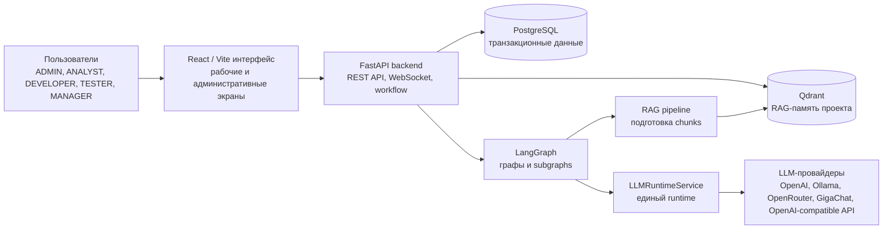
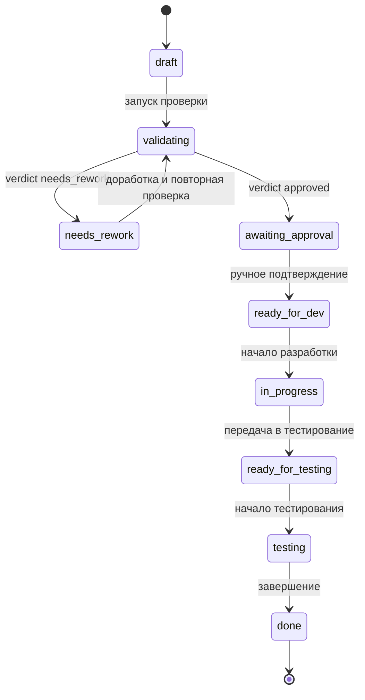
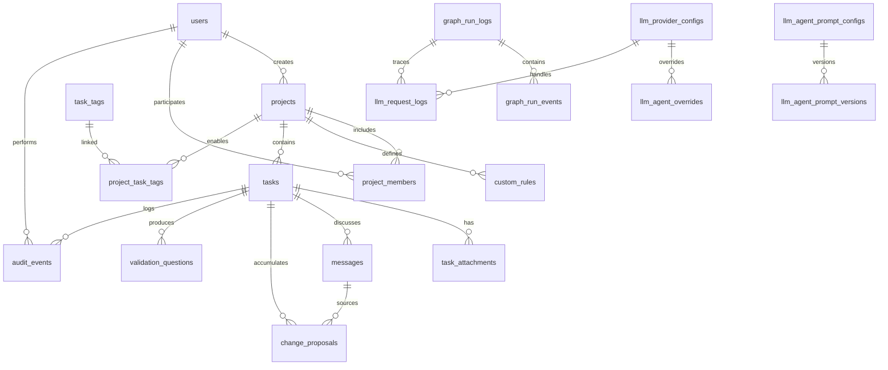

# 1. Проектирование системы

## 1.1 Предметная область и данные

Предметная область магистерской работы относится к управлению требованиями и задачами в программных проектах. В рамках данной области требование рассматривается не только как текстовое описание будущей функциональности, но и как управляемый информационный объект, проходящий последовательные этапы уточнения, проверки, согласования, реализации и тестирования. Такой подход соответствует практической проблеме разработки программного обеспечения: качество исходной постановки влияет на трудоемкость реализации, количество уточнений, вероятность возврата задачи на доработку и полноту последующей проверки результата.

В традиционных системах управления задачами основное внимание часто сосредоточено на хранении карточек, назначении исполнителей и фиксации статуса. Однако для магистерской работы существенным является более широкий контур: необходимо исследовать, как прикладная система может поддерживать жизненный цикл требования, сохранять проектный контекст и обеспечивать интеллектуальную помощь при анализе постановки. Поэтому проектируемая система объединяет данные о пользователях, проектах, требованиях, вложениях, обсуждениях, результатах валидации, предложениях изменений, вопросах для уточнения и семантической памяти проекта.

В системе выделяются роли, соответствующие типовым участникам процесса разработки. `ADMIN` отвечает за администрирование пользователей, справочников, настроек LLM runtime, Qdrant и мониторинга. `ANALYST` формирует требования, редактирует постановки, запускает автоматическую проверку и выполняет ручное подтверждение качества требования. `DEVELOPER` принимает требование в разработку и фиксирует этап реализации. `TESTER` ведет требование на этапе проверки результата. `MANAGER` использует накопленные данные для управленческого контроля и анализа состояния проектных задач. Разделение ролей необходимо для того, чтобы модель данных отражала не только содержимое требования, но и организационный контекст его обработки.

Проект в рассматриваемой системе выступает границей предметного контекста. В рамках проекта объединяются участники, требования, правила проверки, справочники тегов, вопросы валидации и накопленная RAG-память. Это позволяет учитывать, что критерии полноты требования могут зависеть от конкретной предметной области. Например, для требований, связанных с рабочей документацией, важны статусы документов, права изменения, история замечаний и правила выгрузки, тогда как для другой подсистемы могут быть значимы иные справочники и ограничения.

Центральным объектом предметной области является задача, интерпретируемая как требование. Она содержит заголовок, текст постановки, набор тегов, текущий статус, автора, аналитика, проверяющего аналитика, разработчика, тестировщика, результат автоматической проверки и отметку индексации в векторной памяти. В терминах исследования такая сущность является носителем как неструктурированной информации, представленной текстом требования, так и структурированной информации, необходимой для workflow, трассируемости и последующего анализа.

Отдельное значение имеют вложения к требованию. В практических задачах постановка часто дополняется документами, изображениями, таблицами, фрагментами технической документации или скриншотами. Поэтому система сохраняет имя файла, MIME-тип, путь хранения и, при наличии соответствующего контура, текстовое или Vision-описание. Vision-обработка рассматривается как условная возможность, зависящая от настроек и доступного провайдера, а не как обязательное свойство каждого запуска системы. Это важно для корректности научного описания: отчет должен фиксировать фактические условия применимости метода, а не декларировать неограниченную мультимодальность.

Командное обсуждение требования представлено сообщениями чата. Сообщения выполняют двойную функцию. С одной стороны, они фиксируют коммуникацию между участниками проекта. С другой стороны, они становятся входными данными для интеллектуальных сценариев: пользователь может задать вопрос по требованию, предложить изменение или явно направить сообщение конкретному агенту. При этом все ИИ-взаимодействие реализуется через LangGraph. Backend-роутеры не описываются как слой прямого обращения к LLM; они инициируют прикладной сценарий, который оформлен как граф или subgraph с явным состоянием и контролируемыми переходами.

Предложения изменений выделяются в отдельный тип данных. Это позволяет отделить неформальное обсуждение от управляемого процесса корректировки требования. Предложение хранит текст изменения, связь с исходным сообщением, автора, статус рассмотрения и данные о пользователе, принявшем решение. Для магистерской работы такая структура важна тем, что она обеспечивает наблюдаемость эволюции требования: можно проследить, какая корректировка была предложена, кем она была сформулирована, была ли принята и как повлияла на дальнейший жизненный цикл задачи.

Вопросы валидации используются как инструмент проверки полноты постановки. Они могут возникать по результатам автоматической проверки или в ходе обсуждения. Сохранение вопросов в отдельной сущности позволяет формировать расширяемый банк критериев, применимый к будущим требованиям проекта. В исследовательском контексте это означает переход от одноразовой проверки текста к накоплению проектного знания: система не только анализирует конкретную задачу, но и сохраняет повторно используемые признаки неполноты или неоднозначности требований.

Эмпирическим материалом для проверки применимости модели могут выступать задачи из `test_task`: AISNSK-10914, AISNSK-10916, AISNSK-11629, AISNSK-11662, AISNSK-11848 и AISNSK-11811. Эти задачи содержат характерные признаки сложных промышленных требований: справочники, статусы, права, ограничения редактирования, расчетную логику, импорт, выгрузку, зависимость от ранее реализованных задач и необходимость сохранения истории. Их использование позволяет оценивать систему на постановках, близких к реальной инженерной практике, а не только на упрощенных учебных примерах.

Таким образом, данные предметной области можно разделить на несколько взаимосвязанных групп.

| Группа данных | Научно-практическое назначение |
| --- | --- |
| Пользователи и роли | Фиксируют субъектов процесса и ограничения доступа к операциям жизненного цикла требования |
| Проекты и участники | Задают границу предметного контекста и организационную структуру работы |
| Требования/задачи | Содержат текст постановки, workflow-состояние, ответственных участников и результат проверки качества |
| Вложения | Расширяют постановку внешними материалами и дополнительным контекстом |
| Сообщения | Сохраняют коммуникацию и служат входом для LangGraph-сценариев |
| Предложения изменений | Обеспечивают трассируемость корректировок требования |
| Вопросы валидации | Формируют повторно используемый банк критериев полноты постановки |
| Теги и правила проекта | Позволяют учитывать локальные классификации и предметные ограничения |
| Аудит и мониторинг | Поддерживают воспроизводимость действий, запусков графов и LLM-вызовов |

## 1.2 Общая архитектура прикладного решения

Архитектура прикладного решения проектировалась как многоуровневая система поддержки жизненного цикла требований. Основная задача архитектуры состоит в разделении пользовательских сценариев, транзакционной бизнес-логики, семантической памяти и интеллектуальной обработки. Такое разделение необходимо для исследовательской и инженерной проверяемости: каждый слой имеет собственную ответственность, а результаты его работы могут быть зафиксированы и проанализированы отдельно.

Пользовательский интерфейс реализован как SPA на React, TypeScript и Vite. Его назначение заключается в предоставлении участникам проекта рабочих экранов для создания требований, просмотра списка задач, редактирования карточки требования, загрузки вложений, запуска проверки, ведения чата и отслеживания статуса. Отдельная группа экранов предназначена для администрирования пользователей, справочников, LLM-провайдеров, prompt-конфигураций, Qdrant, мониторинга, audit feed и Vision test. Выделение frontend-слоя позволяет отделить представление и пользовательское взаимодействие от серверной логики и от механизмов интеллектуальной обработки.

Серверная часть реализована на FastAPI и выполняет функции прикладного ядра. Она обеспечивает аутентификацию, авторизацию, управление проектами, workflow задач, загрузку вложений, сохранение сообщений, рассмотрение предложений изменений, запуск автоматической валидации и синхронизацию с RAG-контуром. Серверный слой не является простым прокси к модели языка. Его роль состоит в поддержании согласованного состояния предметных сущностей и запуске управляемых сценариев обработки, оформленных через LangGraph.

PostgreSQL используется как основное транзакционное хранилище. В нем фиксируются данные, для которых критичны целостность, связи, статусы, история и воспроизводимость: пользователи, refresh-сессии, проекты, участники, требования, вложения, сообщения, предложения изменений, вопросы валидации, теги, аудит, настройки LLM runtime, журналы запросов и события выполнения графов. Такое решение оправдано тем, что жизненный цикл требования является последовательным процессом с проверяемыми переходами и ответственными участниками.

Qdrant используется как векторное хранилище проектной памяти. В отличие от PostgreSQL, он предназначен не для фиксации транзакционного состояния, а для семантического поиска по накопленному контексту. В текущей реализации используются коллекции `task_knowledge`, `project_questions` и `task_proposals`. В них попадают фрагменты требований, результаты валидации, контекст вложений, вопросы и предложения изменений. Такое разделение отражает различие между источником истины и механизмом поиска релевантного контекста.

Агентный слой реализован через LangGraph. Это принципиальное архитектурное решение для магистерской работы, поскольку оно делает ИИ-взаимодействие не неявным набором prompt-вызовов, а формализованным вычислительным процессом. Графы имеют состояние, узлы обработки и условные переходы. Это позволяет отделять детерминированные этапы обработки от вероятностных ответов LLM. Например, получение задачи из базы данных, выбор активных правил проекта, извлечение похожего контекста из Qdrant и сохранение результата являются детерминированными операциями, тогда как генерация ответа или формирование выводов выполняются через языковую модель.

К основным LangGraph-сценариям относятся `validation_graph`, `chat_graph`, `qa_agent_graph`, `change_tracker_agent_graph`, `manager_agent_graph`, `rag_pipeline` и `task_tag_suggestion_graph`. `validation_graph` проверяет качество требования и формирует verdict. `chat_graph` маршрутизирует сообщения в подходящие subgraphs. `qa_agent_graph` отвечает на вопросы по задаче и контексту. `change_tracker_agent_graph` извлекает предложения изменений. `manager_agent_graph` выполняет fallback-сценарий и объясняет маршрутизацию. `rag_pipeline` готовит chunks для Qdrant. `task_tag_suggestion_graph` помогает подобрать теги из справочника проекта.

Вызовы LLM-провайдеров централизованы в `LLMRuntimeService`. Графы не должны напрямую создавать клиентов OpenAI, Ollama, OpenRouter, GigaChat или OpenAI-compatible API. Runtime учитывает настройки активного провайдера, default provider, agent overrides, prompt configs, параметры модели, режим логирования и сведения для мониторинга. Такое решение повышает воспроизводимость экспериментов и упрощает сравнение различных провайдеров без изменения бизнес-логики и структуры графов.

С точки зрения научного описания предложенная архитектура поддерживает три важных свойства. Первое свойство - проверяемость: состояние задачи, результат валидации, сообщения и предложения изменений сохраняются в явных структурах данных. Второе свойство - воспроизводимость: запуск графа и LLM-запросы могут быть зафиксированы в журналах, что позволяет анализировать причины результата. Третье свойство - расширяемость: новые агентные сценарии могут добавляться как subgraphs, не разрушая общий контур жизненного цикла требования.




Рисунок 1.1 - общая схема компонентов прикладного решения.

## 1.3 Модель данных

Модель данных проектируется как основа для формального описания жизненного цикла требования. Она должна обеспечивать хранение предметных сущностей, фиксацию статусов, прослеживаемость действий, связь между обсуждениями и изменениями, а также интеграцию с RAG-памятью и агентным слоем. Поэтому в модели выделяются не только таблицы для пользователей и задач, но и структуры для сообщений, предложений изменений, вопросов валидации, аудита, мониторинга запусков графов и настроек LLM runtime.

Организационный контур представлен сущностями `users`, `refresh_tokens`, `projects` и `project_members`. `users` хранит учетные записи, роли, профиль, avatar URL и признак активности. `refresh_tokens` фиксирует сессии и позволяет управлять ротацией и отзывом токенов. `projects` задает границу проектного контекста и содержит настройки включения узлов валидации. `project_members` связывает пользователей с проектами и хранит роль участника в рамках конкретного проекта. Такое разделение важно, потому что глобальная роль пользователя и его участие в отдельном проекте являются разными аспектами доступа.

Контур требований представлен таблицами `tasks`, `task_attachments`, `task_tags` и `project_task_tags`. `tasks` является центральной сущностью модели. Она хранит заголовок, текст постановки, массив тегов, статус, автора, аналитика, проверяющего аналитика, разработчика, тестировщика, отметку ручного подтверждения, результат автоматической проверки и время индексации. `task_attachments` связывает требование с дополнительными файлами и при наличии хранит `alt_text`. `task_tags` задает общий справочник тегов, а `project_task_tags` определяет, какие теги доступны в конкретном проекте.

Жизненный цикл требования задается следующим набором статусов:

```text
draft -> validating -> needs_rework / awaiting_approval -> ready_for_dev -> in_progress -> ready_for_testing -> testing -> done
```

Статус `draft` соответствует первичной подготовке требования. Переход в `validating` означает запуск автоматической проверки. После выполнения `validation_graph` возможны два результата: `needs_rework`, если постановка требует доработки, или `awaiting_approval`, если автоматическая проверка не выявила критических препятствий. При этом автоматический verdict не заменяет решение аналитика: перед передачей требования в разработку требуется ручное подтверждение. Далее задача проходит состояния `ready_for_dev`, `in_progress`, `ready_for_testing`, `testing` и `done`, что отражает связь требований с процессами реализации и проверки.




Рисунок 1.2 - жизненный цикл требования в прикладной системе.

Коммуникационный контур представлен сущностями `messages`, `change_proposals` и `validation_questions`. `messages` хранит пользовательские сообщения и ответы агентов. Тип сообщения может принимать значения `general`, `question`, `change_proposal`, `agent_answer` и `agent_proposal`. Это позволяет различать обычную коммуникацию, вопрос к агенту, предложение изменения и результат работы LangGraph-сценария. `change_proposals` фиксирует предложения изменений со статусами `new`, `accepted` и `rejected`. `validation_questions` хранит вопросы, которые используются для проверки полноты требования и могут пополняться в ходе работы с задачей.

Модель трассируемости и администрирования включает `audit_events`, `graph_run_logs`, `graph_run_events`, `llm_request_logs`, `llm_provider_configs`, `llm_runtime_settings`, `llm_agent_overrides`, `llm_agent_prompt_configs` и `llm_agent_prompt_versions`. Эти сущности особенно важны для магистерской работы, поскольку позволяют анализировать не только итоговое состояние требования, но и процесс получения результата. Например, можно связать запуск графа с конкретной задачей, пользователем, узлами обработки, LLM-запросами, latency, ошибками и итоговым состоянием.

PostgreSQL в данной модели выполняет роль источника истины. Он хранит канонические записи о пользователях, проектах, требованиях, статусах, сообщениях, предложениях изменений и результатах проверки. Qdrant выполняет другую функцию: он хранит векторные представления фрагментов контекста для семантического поиска. Такое разделение снижает риск смешения транзакционной и поисковой логики. Если PostgreSQL отвечает на вопрос "каково текущее состояние требования", то Qdrant помогает ответить на вопрос "какой накопленный контекст релевантен текущему требованию или вопросу пользователя".

В текущей реализации используются три Qdrant-коллекции.

| Коллекция Qdrant | Назначение |
| --- | --- |
| `task_knowledge` | Хранит контекст задач, фрагменты описаний, результаты валидации, теги и данные вложений |
| `project_questions` | Хранит вопросы валидации, применимые для повторного использования в проекте |
| `task_proposals` | Хранит предложения изменений и используется для поиска дублей |

Связь между PostgreSQL и Qdrant обеспечивается через идентификаторы проекта, задачи и metadata chunks. Это позволяет агентам получать семантически релевантный контекст, но не переносит ответственность за целостность предметных данных в векторное хранилище. Для научного описания это различие принципиально: RAG-память является вспомогательным механизмом повышения качества ответов и проверок, а не заменой реляционной модели данных.




Рисунок 1.3 - основные связи модели данных.

В результате модель данных обеспечивает несколько исследовательски значимых свойств. Во-первых, она поддерживает прослеживаемость жизненного цикла требования от черновика до завершения. Во-вторых, она позволяет отделять факт изменения требования от обсуждения этого изменения. В-третьих, она связывает результаты LangGraph-сценариев с предметными сущностями и журналами выполнения. В-четвертых, она обеспечивает основу для RAG-памяти проекта без нарушения транзакционной целостности основной базы данных.
