# 1. Проектирование системы

## 1.1 Предметная область и данные

Предметная область магистерской работы связана с управлением задачами и требованиями в проектной команде. В рамках производственной практики рассматривалась не изолированная задача хранения карточек, а прикладной процесс сопровождения требования от первичного описания до передачи в разработку, тестирования и завершения. Такой процесс требует фиксации текста требования, участников, статусов, обсуждений, вложений, результатов автоматической проверки и накопленного проектного контекста.

Разрабатываемая система ориентирована на работу нескольких ролей. `ADMIN` отвечает за пользователей, справочники, настройки LLM runtime, Qdrant и мониторинг. `ANALYST` создает и дорабатывает требования, запускает проверку качества постановки и подтверждает готовность требования к дальнейшей работе. `DEVELOPER` ведет задачу на этапе реализации. `TESTER` отвечает за тестирование и фиксацию готовности результата. `MANAGER` участвует в управленческих сценариях проекта и может использовать накопленный контекст для контроля состояния требований.

Базовой организационной единицей является проект. Проект объединяет участников, набор требований, проектные правила проверки и справочники тегов. Такое разделение позволяет хранить контекст внутри границ конкретной команды или предметной области, а также применять к требованиям не только общие критерии качества, но и локальные правила проекта.

Центральной сущностью системы является задача, которая в отчете рассматривается как требование. Она содержит заголовок, текст постановки, теги, текущий статус, автора, назначенных участников, результат валидации и отметку индексации в RAG-памяти. Требование может сопровождаться вложениями: документами, изображениями и дополнительными материалами. Для вложений сохраняются имя файла, MIME-тип, путь хранения и при наличии результат текстового или Vision-описания. Vision-обработка не рассматривается как гарантированная функция любого запуска: она зависит от настроек системы и доступного LLM-провайдера.

Важной частью предметной области является командное обсуждение требования. Сообщения чата используются не только как коммуникационный журнал, но и как источник данных для агентных сценариев. Сообщение может быть обычной репликой, вопросом, предложением изменения, ответом агента или агентным предложением. Взаимодействие с ИИ реализуется через LangGraph: backend-роутеры не выступают слоем прямого обращения к LLM, а запускают управляемые графы и subgraphs.

Система фиксирует предложения изменений как отдельные артефакты. Это позволяет отделить обсуждение от конкретного решения по корректировке требования. Предложение имеет статус `new`, `accepted` или `rejected`, ссылку на исходное сообщение, автора и данные о рассмотрении. Такой подход полезен для магистерской работы, потому что дает наблюдаемую модель сопровождения изменения требования, а не только текстовую переписку.

Для проверки полноты требований используется банк вопросов валидации. Вопросы могут появляться в результате автоматической проверки или обсуждения в чате. Они сохраняются как отдельные записи, связываются с задачей и затем могут использоваться в RAG-контуре как часть проектной памяти. Дополнительно используются теги задач и проектные правила проверки, которые помогают учитывать специфику предметной области.

В качестве демонстрационных данных в работе целесообразно использовать задачи из `test_task`, например AISNSK-10914, AISNSK-10916, AISNSK-11629, AISNSK-11662, AISNSK-11848 и AISNSK-11811. Эти примеры содержат характерные для промышленной постановки условия: справочники, статусы, ограничения прав, расчетную логику, импорт, выгрузку, зависимость от предыдущих задач и требования к сохранению истории. Поэтому они подходят для проверки того, что система работает не только с короткими пользовательскими историями, но и со сложными требованиями, где важно выделять сущности, условия, сценарии ошибок и ожидаемые результаты.

Ключевые группы данных предметной области:

| Группа данных | Назначение в системе |
| --- | --- |
| Пользователи и роли | Определяют доступные действия и участие в жизненном цикле требования |
| Проекты и участники | Ограничивают рабочий контекст, правила и состав команды |
| Требования/задачи | Хранят постановку, статус, участников, validation result и RAG-состояние |
| Вложения | Дополняют требование документами, изображениями и извлеченным контекстом |
| Сообщения | Фиксируют обсуждение и результаты работы LangGraph-агентов |
| Предложения изменений | Сохраняют управляемые корректировки требования |
| Вопросы валидации | Поддерживают проверку полноты постановки |
| Теги и правила проекта | Уточняют классификацию и критерии проверки требований |
| Аудит | Обеспечивает прослеживаемость действий пользователя и системных событий |

## 1.2 Общая архитектура прикладного решения

Прикладное решение построено как веб-система с разделением пользовательского интерфейса, серверной бизнес-логики, транзакционного хранилища, векторной памяти и агентного слоя. Такое разделение выбрано для того, чтобы отделить пользовательские сценарии от хранения данных и от управляемого ИИ-взаимодействия.

Пользовательский интерфейс реализован как SPA на React, TypeScript и Vite. Он предоставляет рабочие экраны для проектов, списка задач, карточки требования, чата, загрузки вложений и проверки требований. Отдельно реализованы административные экраны для пользователей, справочников, настроек LLM-провайдеров, prompt configs, Qdrant, мониторинга, audit feed и Vision test. Интерфейс использует REST API для прикладных операций и WebSocket для обновлений чата.

Серверная часть реализована на FastAPI. Она отвечает за аутентификацию, проверку доступа, управление проектами и задачами, workflow требования, загрузку вложений, сохранение сообщений, рассмотрение предложений изменений, запуск валидации и интеграцию с RAG-контуром. Работа с PostgreSQL выполняется через SQLAlchemy AsyncIO, структура данных поддерживается миграциями Alembic.

PostgreSQL используется как основное транзакционное хранилище. В нем сохраняются пользователи, refresh-сессии, проекты, участники, задачи, вложения, сообщения, предложения изменений, вопросы валидации, теги, аудит, настройки LLM runtime, журналы LLM-запросов и события выполнения графов. Такое хранилище нужно для согласованного workflow и воспроизводимой истории действий.

Qdrant используется как векторная память проекта. В текущей реализации выделены коллекции `task_knowledge`, `project_questions` и `task_proposals`. В них индексируются фрагменты требований, результаты валидации, контекст вложений, вопросы и предложения изменений. Qdrant не заменяет PostgreSQL, а дополняет его семантическим поиском по накопленному контексту.

ИИ-взаимодействие в системе реализуется через LangGraph. Агентные сценарии оформлены как графы и subgraphs: `validation_graph`, `chat_graph`, `qa_agent_graph`, `change_tracker_agent_graph`, `manager_agent_graph`, `rag_pipeline`, `task_tag_suggestion_graph` и вспомогательные графы проверки провайдеров и Vision-сценариев. Такой подход позволяет явно задавать состояние графа, узлы обработки, условные переходы, маршрутизацию и точки расширения.

Вызовы LLM-провайдеров централизованы в `LLMRuntimeService`. Графы не создают клиентов OpenAI, Ollama, OpenRouter, GigaChat или OpenAI-compatible API напрямую. Runtime учитывает default provider, agent overrides, prompt configs, параметры модели и журналирование запросов. Это повышает управляемость системы и позволяет менять провайдера без переписывания прикладных сценариев.

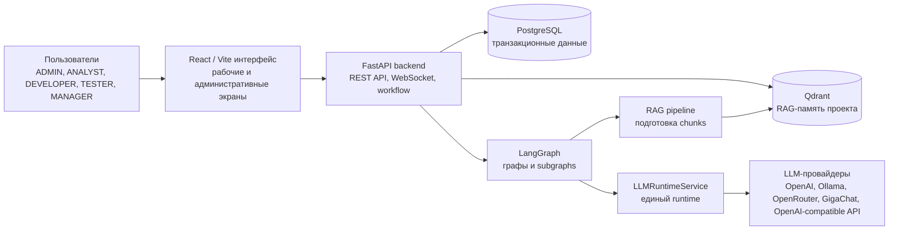


Рисунок 1.1 - общая схема компонентов прикладного решения.

## 1.3 Модель данных

Модель данных ориентирована на сопровождение требования в течение полного жизненного цикла. В ней выделены сущности для организационного контура, содержимого требования, коммуникации, проверки качества, RAG-памяти, агентного выполнения и администрирования LLM runtime.

Основные сущности PostgreSQL:

| Сущность | Назначение |
| --- | --- |
| `users` | Учетные записи, роли, профиль, avatar URL и признак активности |
| `refresh_tokens` | Refresh-сессии, ротация и отзыв токенов |
| `projects` | Проекты и настройки включения узлов валидации |
| `project_members` | Связь пользователей с проектами и проектная роль участника |
| `custom_rules` | Проектные правила проверки требований |
| `tasks` | Требования, статусы, участники, validation result и `indexed_at` |
| `task_attachments` | Вложения задач, MIME-тип, путь хранения и `alt_text` |
| `messages` | Сообщения чата, ответы агентов и source references |
| `change_proposals` | Предложения изменений и статусы их рассмотрения |
| `validation_questions` | Вопросы для проверки полноты требований |
| `task_tags` | Глобальный справочник тегов задач |
| `project_task_tags` | Связь справочника тегов с конкретным проектом |
| `audit_events` | Журнал действий пользователей и системных событий |
| `graph_run_logs`, `graph_run_events` | Мониторинг запусков LangGraph-графов и событий узлов |
| `llm_provider_configs` | Настройки LLM-провайдеров |
| `llm_agent_overrides` | Переопределения провайдера для отдельных agent key |
| `llm_request_logs` | Журнал LLM-запросов, latency, tokens, cost и ошибок |
| `llm_runtime_settings` | Runtime defaults и настройки мониторинга графов |
| `llm_agent_prompt_configs`, `llm_agent_prompt_versions` | Конфигурации prompt templates и история версий |

В модели явно разделены глобальная роль пользователя и участие в проекте. Глобальная роль определяет общий уровень доступа, а `project_members` фиксирует принадлежность к конкретному проекту. Это позволяет использовать одну учетную запись в разных проектных контекстах.

`tasks` является центральной таблицей для требований. Помимо заголовка и текста, она хранит массив тегов, текущий статус, автора, аналитика, проверяющего аналитика, разработчика, тестировщика, время ручного подтверждения, результат автоматической проверки и время последней индексации. Такое устройство позволяет связать текст требования с workflow, ответственными участниками и RAG-состоянием.

Жизненный цикл требования задается статусами:

```text
draft -> validating -> needs_rework / awaiting_approval -> ready_for_dev -> in_progress -> ready_for_testing -> testing -> done
```

После статуса `validating` дальнейший переход зависит от результата `validation_graph`. Если verdict равен `needs_rework`, задача возвращается на доработку. Если verdict равен `approved`, задача переходит в `awaiting_approval`, после чего требуется ручное подтверждение. Только после этого требование может перейти в разработку и затем в тестирование.

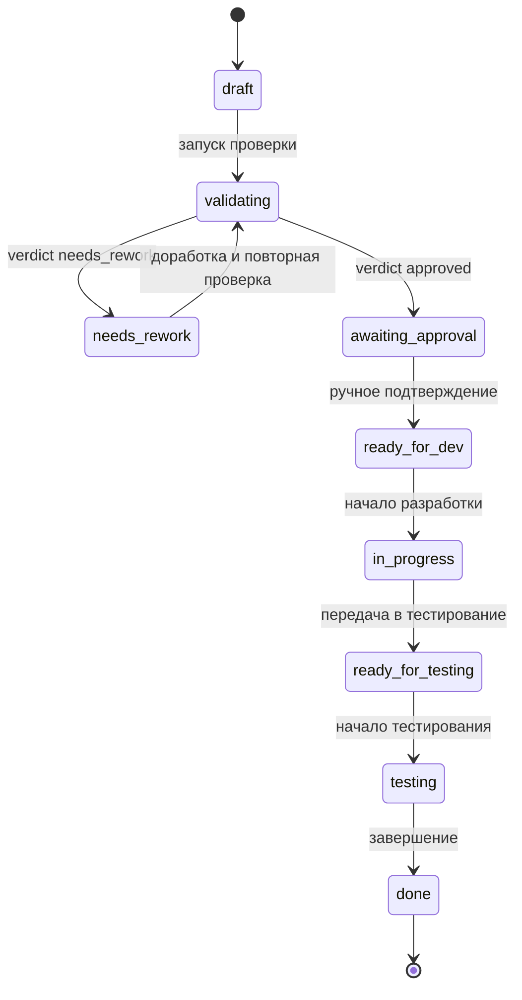


Рисунок 1.2 - жизненный цикл требования в прикладной системе.

Коммуникационная часть модели построена вокруг `messages` и `change_proposals`. Сообщения позволяют хранить как пользовательскую переписку, так и результаты работы LangGraph-агентов. Если сообщение содержит предложение изменения, оно может быть вынесено в `change_proposals`, где фиксируются статус рассмотрения, автор, источник и дата решения.

Вопросы валидации хранятся в `validation_questions`. Они связываются с задачей, имеют источник, текст вопроса, verdict и порядок отображения. Эти данные используются как расширяемый чек-лист качества требования и как источник повторно используемого контекста.

Для RAG используются не отдельные SQL-таблицы, а Qdrant-коллекции:

| Коллекция Qdrant | Содержимое |
| --- | --- |
| `task_knowledge` | Контекст задач, фрагменты описаний, вложения, теги и результаты валидации |
| `project_questions` | Вопросы валидации для повторного использования в рамках проектного контекста |
| `task_proposals` | Предложения изменений и данные для поиска дублей |

Связь PostgreSQL и Qdrant строится через идентификаторы проекта, задачи и chunk metadata. PostgreSQL остается источником истины для транзакционных сущностей, а Qdrant используется для семантического поиска и передачи релевантного контекста LangGraph-агентам.

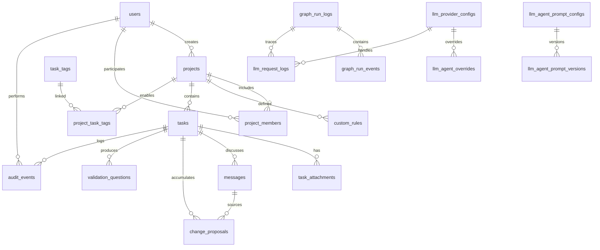


Рисунок 1.3 - основные связи модели данных.

Таким образом, модель данных отражает не только хранение требований, но и полный прикладной контур магистерской системы: проектную работу, жизненный цикл требования, проверку качества, обсуждение, предложения изменений, RAG-память и управляемое выполнение LangGraph-сценариев.

## 1.4 Проектирование агентного слоя

Агентный слой в разрабатываемой системе проектируется как управляемый контур интеллектуальной обработки требований. Его назначение состоит не в замене пользователя при принятии проектных решений, а в формализации повторяющихся аналитических операций: проверке полноты постановки, поиске релевантного контекста, ответах на вопросы по задаче, фиксации предложений изменений и поддержке классификации требований. В рамках магистерской работы данный слой рассматривается как прикладная реализация подхода к сопровождению требований, при котором ИИ-взаимодействие встроено в жизненный цикл задачи, но остается ограниченным, наблюдаемым и проверяемым.

Ключевым архитектурным решением является использование LangGraph как слоя оркестрации AI-сценариев. В системе не используется модель, при которой backend-роутер напрямую формирует произвольный prompt и отправляет его в LLM-провайдер. Вместо этого каждый интеллектуальный сценарий оформляется как граф или subgraph. Граф имеет явное состояние, набор узлов обработки и переходы между узлами, включая условные переходы. Такое представление позволяет описывать не только факт обращения к языковой модели, но и весь процесс обработки: подготовку входных данных, выбор маршрута, получение контекста из RAG-памяти, вызов LLM, разбор результата, резервное поведение при ошибках и сохранение прикладных артефактов.

Проектирование агентного слоя опирается на несколько критериев.

| Критерий | Смысл для магистерской системы | Реализация в проекте |
| --- | --- | --- |
| Управляемость | Сценарий должен быть представлен как последовательность контролируемых этапов | LangGraph-графы с явными узлами и переходами |
| Наблюдаемость | Результат AI-сценария должен быть связан с конкретным запуском, узлом и LLM-вызовом | `graph_run_logs`, `graph_run_events`, `llm_request_logs` |
| Разделение ответственности | Детерминированная бизнес-логика не должна смешиваться с вероятностной генерацией текста | Сервисы сохраняют данные и управляют workflow, графы выполняют сценарии, `LLMRuntimeService` вызывает модели |
| Ограничение зоны ответственности агента | Каждый агент должен решать узкую прикладную задачу | `qa_agent_graph`, `change_tracker_agent_graph`, `manager_agent_graph` как отдельные subgraphs |
| Расширяемость | Новые агентные сценарии должны добавляться без переписывания общего чата | `subgraph_registry` и подключение внешних модулей через `CHAT_AGENT_MODULES` |
| Визуальная проверяемость | Состав сценариев должен быть доступен для контроля и обсуждения | Экспорт схем графов и отдельные Mermaid-иллюстрации в отчете |

Backend-сервисы в такой архитектуре выступают инициаторами агентных сценариев. `TaskService` запускает проверку требования, подбор тегов и индексацию контекста, `ChatService` сохраняет пользовательское сообщение и передает его в `chat_graph`, `RagService` инициирует подготовку индексируемых фрагментов для Qdrant. При этом сервисы не создают LLM-клиенты напрямую. Все обращения к языковым моделям централизованы в `LLMRuntimeService`, который учитывает настройки runtime, активного провайдера, agent-specific overrides, prompt configs, параметры модели и журналирование запросов. Важно подчеркнуть, что `LLMRuntimeService` не заменяет бизнес-логику: решение о статусах задачи, правах доступа, сохранении сообщений и создании предложений изменений остается в прикладных сервисах.

Агентный слой связан с двумя типами хранилищ. PostgreSQL сохраняет транзакционные данные и результаты выполнения сценариев: задачи, сообщения, предложения изменений, вопросы валидации, результаты проверки, журналы запусков графов и LLM-запросов. Qdrant используется как семантическая память проекта. При этом разные графы используют Qdrant по-разному: `rag_pipeline` подготавливает chunks для записи в `task_knowledge`, `rag_retrieval_graph` читает `task_knowledge` для QA-сценария, `validation_graph` использует `project_questions`, а `change_tracker_agent_graph` проверяет дубли в `task_proposals`. Такое уточнение важно, потому что векторное хранилище не является универсальной заменой PostgreSQL и не управляет workflow напрямую.

Основные графы агентного слоя представлены в таблице 1.4.

| Граф | Назначение | Входные данные | Основные этапы | Результат и дальнейшее использование |
| --- | --- | --- | --- | --- |
| `validation_graph` | Проверка качества требования перед переводом задачи к ручному подтверждению или доработке | Заголовок, описание, теги, правила проекта, похожие задачи, вложения, настройки узлов валидации | Нормализация входа, проверка базовых критериев, проверка проектных правил, поиск контекстных вопросов, формирование verdict | Возвращает `approved` или `needs_rework`, список проблем и уточняющих вопросов; результат сохраняется в `tasks.validation_result` и влияет на статус задачи |
| `chat_graph` | Оркестрация обработки сообщений в чате задачи | Сообщение пользователя, тип сообщения, контекст задачи, `task_id`, `project_id`, пользователь, результат валидации | Подготовка контекста, forced routing или auto-routing, сбор похожих задач, запуск выбранного subgraph, сохранение артефактов | Формирует агентное сообщение, предложение изменения или вопрос для backlog; результат сохраняется в `messages`, `change_proposals` или `validation_questions` |
| `qa_agent_graph` | Ответы на вопросы пользователя по текущей задаче и проектному контексту | Вопрос, текст задачи, статус, validation result, похожие задачи, RAG-контекст | Планирование ответа, запуск retrieval при необходимости, генерация ответа, опциональная verifier-стадия | Возвращает ответ QA Agent, confidence, `source_ref` и при низкой уверенности вопрос для будущей валидации |
| `rag_retrieval_graph` | Подготовка источников для QA Agent | Вопрос пользователя, задача, проект, лимит поиска, RAG-параметры | Переформулирование поискового запроса, поиск chunks, учет вложений текущей задачи, поиск cross-task контекста, rerank | Возвращает отобранные chunks, `chunk_ids`, ссылки на источники и диагностические данные для `qa_agent_graph` |
| `change_tracker_agent_graph` | Преобразование реплики пользователя в структурированное предложение изменения | Сообщение пользователя, контекст задачи, проект, пользователь, режим маршрутизации | Подготовка prompt, извлечение нормализованного предложения, поиск дублей в `task_proposals`, финализация ответа | Возвращает `proposal_text` или сообщение о дубле; `chat_graph` сохраняет новое предложение в `change_proposals`, если дубль не найден |
| `manager_agent_graph` | Резервный сценарий и пояснение маршрутизации | Сообщение пользователя, запрошенный agent alias, список зарегистрированных subgraphs | Анализ причины fallback, формирование ответа о доступных маршрутах | Возвращает поясняющее agent-сообщение; используется при неизвестном forced routing или отсутствии подходящего агента |
| `rag_pipeline` | Подготовка нормализованных chunks для векторной памяти | Заголовок, описание, теги, вложения, извлеченный текст, `alt_text`, validation result | Сбор источников, подготовка attachment sources, добавление validation sources, chunking с overlap, формирование metadata | Возвращает список chunks и `chunk_ids`; запись в Qdrant выполняется сервисным слоем |
| `task_tag_suggestion_graph` | Подбор тегов задачи из справочника проекта | Текст задачи, проект, доступные теги, пользовательский контекст | Формирование prompt, вызов LLM, разбор JSON-ответа, фильтрация по доступному справочнику и confidence | Возвращает до пяти допустимых тегов с обоснованием; используется при создании и редактировании требования |

Дополнительно в системе есть вспомогательные графы, которые не являются основными сценариями сопровождения требования, но поддерживают работу агентного слоя. `attachment_vision_graph` формирует `alt_text` для изображений во вложениях, если Vision-обработка включена и доступен подходящий провайдер. `provider_test_graph` используется для проверки конфигурации LLM-провайдера из административного интерфейса. `vision_test_graph` проверяет Vision-провайдера и не должен описываться как обязательная функция каждого запуска системы.

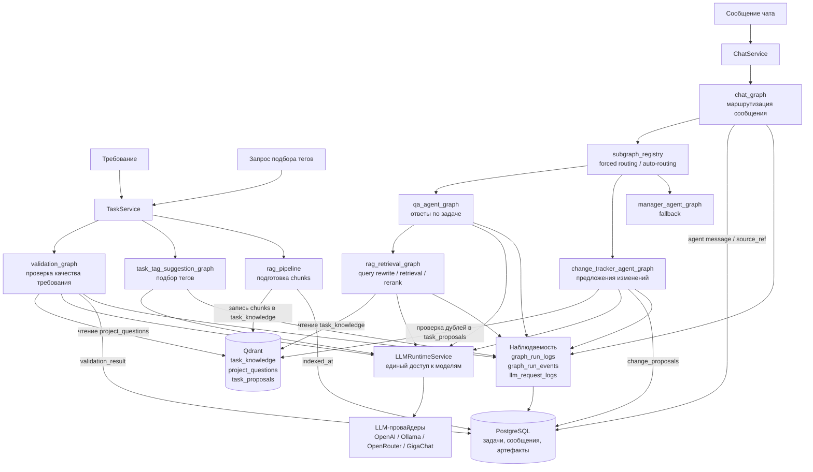


Рисунок 1.4 - схема агентного слоя магистерской системы.

Центральным элементом обработки сообщений является `chat_graph`. Он отделяет пользовательскую коммуникацию от выбора конкретного агента. После сохранения исходного сообщения граф формирует `ChatAgentContext`, учитывает явное указание агента через forced routing и при его отсутствии использует `subgraph_registry`. Встроенные subgraphs регистрируются с метаданными, приоритетом и функцией `can_handle`, что позволяет последовательно проверять применимость QA Agent и ChangeTracker Agent. Если пользователь явно указал неизвестный agent alias, управление передается Manager Agent, который сообщает о доступных маршрутах. Такой механизм делает маршрутизацию воспроизводимой и расширяемой.

`qa_agent_graph` спроектирован как многоэтапный граф, а не как единичный генеративный ответ. Сначала формируется план ответа: определяется, достаточно ли текущего контекста задачи или нужен поиск по RAG-памяти. Если поиск необходим, вызывается `rag_retrieval_graph`. Он подготавливает поисковые варианты вопроса, извлекает кандидаты из `task_knowledge`, учитывает вложения текущей задачи, собирает cross-task контекст внутри проекта и выполняет rerank найденных chunks. После этого QA Agent получает не произвольную выборку текста, а отобранный набор источников с `chunk_ids` и `source_ref`. При глубоком анализе или необходимости дополнительной проверки граф может выполнить verifier-стадию. Если уверенность ответа низкая, граф возвращает canonical question, который затем может быть сохранен как вопрос для будущей валидации.

`change_tracker_agent_graph` решает другую задачу: он переводит свободную реплику пользователя в управляемый артефакт изменения требования. Граф нормализует формулировку предложения, отделяет ее от разговорной части сообщения и проверяет наличие похожего предложения через Qdrant-коллекцию `task_proposals`. Если найден дубль, система не создает повторную запись, а возвращает информационный ответ. Если дубль не найден, `chat_graph` сохраняет предложение в `change_proposals`. Благодаря этому обсуждение требования остается связанным с формальными изменениями, которые можно принять или отклонить.

`validation_graph` связан с жизненным циклом требования. Он проверяет постановку до ручного подтверждения аналитиком и строится как последовательность стадий: базовые критерии качества, проектные правила и контекстные вопросы. При обнаружении существенных проблем граф может завершиться раньше, не переходя к последующим стадиям. Такой early stop снижает избыточные LLM-вызовы и делает результат проверки понятнее: сначала устраняются базовые недостатки, затем учитываются специфические правила проекта, после чего анализируется накопленный контекст. Итоговый verdict сохраняется в задаче и определяет дальнейший workflow.

`rag_pipeline` выполняет подготовительную, но принципиально важную функцию. Он не принимает решений и не обращается к LLM как к агенту анализа требований, а формирует индексируемые фрагменты: заголовок, описание, теги, содержимое вложений, `alt_text` изображений при доступной Vision-обработке и результат валидации. Запись в Qdrant выполняется сервисным слоем, что сохраняет разделение ответственности между подготовкой данных и операцией индексации. В дальнейшем эти chunks используются не напрямую всеми графами одинаково, а через конкретные сценарии: `rag_retrieval_graph` читает `task_knowledge` для QA Agent, `validation_graph` обращается к `project_questions`, а `change_tracker_agent_graph` проверяет дубли в `task_proposals`.

`task_tag_suggestion_graph` ограничен справочником проекта и не должен создавать произвольные теги. Это решение важно для качества данных: теги используются для фильтрации, проектных правил и аналитики, поэтому генеративная модель не должна расширять справочник неявно. Граф возвращает только те предложения, которые входят в список доступных тегов и проходят фильтрацию по уверенности и обоснованию.

Наблюдаемость агентного слоя обеспечивается журналами `graph_run_logs`, `graph_run_events` и `llm_request_logs`. Для магистерской работы это имеет методологическое значение: результат AI-сценария можно анализировать не только как конечный текст, но и как последовательность этапов выполнения. Журналирование позволяет видеть, какой граф был запущен, какие узлы выполнялись, какие LLM-вызовы произошли, сколько времени занял сценарий и была ли ошибка. В текущей реализации воспроизводимость анализа описывается именно через эти журналы PostgreSQL и `source_ref`, а не как использование встроенного LangGraph-checkpointing.

Таким образом, проектирование агентного слоя основано на принципе управляемой интеллектуальной оркестрации. LangGraph задает структуру сценариев, `LLMRuntimeService` централизует работу с моделями, PostgreSQL сохраняет транзакционные результаты и мониторинг, Qdrant предоставляет семантическую память, а backend-сервисы связывают эти элементы с жизненным циклом требования. Такой подход соответствует целям магистерской работы, поскольку позволяет исследовать не абстрактное применение LLM, а воспроизводимую архитектуру поддержки требований в проектной системе.

## 1.5 RAG-память проекта

RAG-память проекта в разрабатываемой системе рассматривается как специализированный контур накопления и повторного использования проектного знания. В рамках магистерской работы она нужна не как самостоятельная база требований и не как замена трекера задач, а как механизм семантического доступа к контексту, который уже возник в ходе жизненного цикла требования: текстам постановок, вложениям, результатам автоматической проверки, вопросам уточнения и предложениям изменений. Такое назначение соответствует исследовательской гипотезе работы: если проектный контекст сохраняется в форме, пригодной для поиска и последующего использования LangGraph-сценариями, то система может снижать потери знаний между участниками команды и повышать полноту анализа новых требований.

Принципиальное архитектурное решение состоит в разделении транзакционного состояния и семантической памяти. PostgreSQL остается источником истины для пользователей, проектов, задач, статусов, вложений, сообщений, предложений изменений, результатов проверки и решений пользователей. Именно в PostgreSQL фиксируется, в каком статусе находится требование, кто его подтвердил, какие предложения были приняты и какие события попали в аудит. Qdrant хранит не каноническое состояние предметных сущностей, а векторные представления текстовых фрагментов и их metadata. Поэтому Qdrant не должен использоваться для определения прав, статусов или окончательных решений по workflow; его роль ограничена поиском релевантного контекста для управляемых LangGraph-графов.

В текущей реализации RAG-память организована через три Qdrant-коллекции. Такое разделение важно методологически: разные типы знания имеют разные источники, разные критерии похожести и разные последствия для сценария обработки.

| Коллекция | Источник данных | Тип поиска | Потребляющий граф | Прикладной результат |
| --- | --- | --- | --- | --- |
| `task_knowledge` | Текст задачи, вложения, результат валидации и metadata задачи | Поиск chunks текущей задачи и cross-task контекста внутри проекта | `rag_retrieval_graph`, далее `qa_agent_graph` | Ответ агента с опорой на source references и найденные `chunk_ids` |
| `project_questions` | Вопросы валидации, сформированные в ходе проверки или обсуждения | Поиск повторно применимых уточняющих вопросов | `validation_graph` | Дополнение проверки требования контекстными вопросами проекта |
| `task_proposals` | Предложения изменений, сохраненные как управляемые артефакты | Поиск семантически близких предложений | `change_tracker_agent_graph` | Выявление дублей и снижение числа повторных предложений |

Коллекция `task_knowledge` является основным индексом контекста требований. Для нее `rag_pipeline` формирует source documents из нескольких источников: заголовка и описания задачи, текстового содержимого вложений, `alt_text` изображений при доступной Vision-обработке, а также замечаний и вопросов из результата валидации. Теги задачи не рассматриваются как отдельный текстовый источник; они сохраняются в metadata chunks и используются для классификации, фильтрации, диагностики и интерпретации найденного контекста. Такой подход предотвращает смешение содержательного текста требования со служебными классификаторами.

Контур индексации начинается в сервисном слое. `RagService` получает актуальное состояние задачи из PostgreSQL, загружает связанные вложения и подготавливает payloads. Для текстовых вложений извлекается ограниченный объем текста, что защищает индекс от чрезмерно больших документов. Для изображений возможно формирование `alt_text`, но только если включен Vision-контур и доступен подходящий LLM-провайдер. Далее `rag_pipeline` последовательно выделяет источники `task_content`, `attachment_text`, `attachment_image_alt_text` и `validation_result`, разбивает их на chunks с целевым размером и overlap, присваивает каждому фрагменту стабильный `chunk_id` и формирует metadata: `source_type`, `source_id`, `project_id`, `task_id`, статус задачи, заголовок задачи, теги и при наличии имя файла. После подготовки документов `QdrantService.replace_task_knowledge` заменяет индекс задачи в `task_knowledge`, удаляя устаревшие chunks, а в PostgreSQL обновляется `indexed_at`. Эта отметка важна для проверяемости: она показывает, что транзакционное состояние задачи было синхронизировано с векторной памятью.

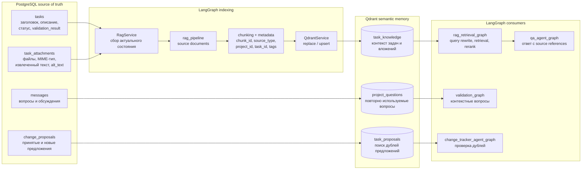


Рисунок 1.5 - схема RAG-памяти проекта.

Контур retrieval используется прежде всего в сценарии ответов на вопросы по задаче. `qa_agent_graph` не должен отвечать только на основании общих знаний языковой модели, если для вопроса нужен проектный контекст. Поэтому при необходимости он вызывает `rag_retrieval_graph`. Этот граф подготавливает поисковые варианты вопроса, извлекает кандидаты из `task_knowledge`, отдельно анализирует вложения текущей задачи и cross-task контекст внутри проекта, после чего выполняет rerank. На выходе формируется не произвольная подборка текста, а ограниченный набор фрагментов с `chunk_ids`, именами файлов при наличии, source references и диагностикой найденных chunks. Далее QA Agent использует эти материалы как справочный контекст; если найденные фрагменты конфликтуют с текущей задачей, приоритет сохраняется за текущим текстом требования и транзакционными данными PostgreSQL.

Коллекция `project_questions` поддерживает другой аспект проектной памяти - повторное использование вопросов, выявляющих неполноту или неоднозначность требований. Если при проверке или обсуждении задачи появляется вопрос, полезный для будущих постановок, он может быть сохранен и синхронизирован с Qdrant. При следующей проверке `validation_graph` использует эту коллекцию как расширяемый банк контекстных вопросов. В научном смысле это переводит систему от одноразовой генерации замечаний к накоплению предметно-специфических признаков качества требований.

Коллекция `task_proposals` используется для сопровождения изменений. `change_tracker_agent_graph` преобразует свободную реплику пользователя в нормализованное предложение и проверяет, существует ли уже семантически близкий артефакт. Если похожее предложение найдено с достаточной близостью, система может сообщить о дубле и не создавать повторную запись. Если дубль не обнаружен, предложение сохраняется в PostgreSQL и индексируется в Qdrant. Такой механизм важен для трассируемости эволюции требования: обсуждения не растворяются в чате, а переводятся в управляемые предложения, которые можно принять или отклонить.

Качество RAG-памяти зависит от ряда контролируемых и неконтролируемых факторов. К контролируемым относятся параметры chunking, включая целевой размер фрагмента, overlap и максимальную длину chunk; в текущей конфигурации они задаются через `RAG_CHUNK_TARGET_TOKENS`, `RAG_CHUNK_OVERLAP_TOKENS` и `RAG_CHUNK_MAX_CHARS`. Для вложений дополнительно действует лимит извлеченного текста `RAG_ATTACHMENT_MAX_TEXT_CHARS`. На этапе retrieval используется порог `RAG_CHUNK_MIN_SCORE`, который определяет, какие кандидаты могут попасть в контекст ответа. Отдельное значение имеет embedding-конфигурация: провайдер, модель и размерность векторов должны соответствовать состоянию коллекций Qdrant, иначе семантический поиск становится технически некорректным или нерепрезентативным.

К неконтролируемым или частично контролируемым факторам относятся полнота исходной постановки, качество текста вложений, наличие устаревших материалов, неоднозначность терминологии и доступность Vision-провайдера. Vision-сценарий в отчете следует описывать только как условную возможность: `alt_text` изображений попадает в RAG-память при включенной Vision-обработке, допустимом размере файла и доступном провайдере, но не является гарантированным источником для каждого запуска системы. Поэтому основная научная оценка RAG-памяти должна строиться вокруг текстовых требований, извлеченного текста вложений, вопросов валидации и предложений изменений.

С исследовательской точки зрения RAG-память задает основу для последующей оценки эффективности системы. Ее можно анализировать по полноте покрытия задач индексом, доле требований с актуальным `indexed_at`, качеству найденных source references, применимости вопросов из `project_questions`, числу предотвращенных дублей предложений и влиянию найденного контекста на ответы QA Agent. При этом RAG-контур не устраняет экспертную проверку аналитика: он предоставляет LangGraph-сценариям и пользователю релевантный материал, но окончательные решения по качеству требования, принятию изменений и переходам workflow остаются управляемыми действиями участников проекта.

## 1.6 Методика оценки эффективности системы

Методика оценки эффективности разрабатываемой системы необходима для того, чтобы связать архитектурные решения, описанные в предыдущих подразделах, с проверяемой научной гипотезой магистерской работы. В данном исследовании эффективность не сводится к факту наличия работающего прототипа или к субъективному удобству интерфейса. Под эффективностью понимается способность системы поддерживать процесс управления требованиями таким образом, чтобы повышалась полнота анализа постановки, снижались потери проектного контекста, сохранялась трассируемость решений и обеспечивалась управляемость AI-сценариев через LangGraph.

Для производственной практики оценка имеет характер апробационной методики. Это означает, что в рамках данного этапа фиксируются критерии, источники данных, процедура сравнения и ограничения валидности, а не заявляются статистически подтвержденные проценты улучшения. Полноценное экспериментальное подтверждение требует размеченной выборки требований, повторяемого baseline-сценария и экспертной разметки результатов. Поэтому в данном разделе формируется научно обоснованная схема оценки, которую можно применить к демонстрационным кейсам практики и расширить на следующем этапе магистерского исследования.

Объектом оценки является не отдельный языковой ответ модели, а прикладной процесс обработки требования в системе. В этот процесс входят жизненный цикл задачи от черновика до завершения, автоматическая проверка качества требования в `validation_graph`, сохранение результата в `tasks.validation_result`, использование RAG-памяти на базе Qdrant, сопровождение обсуждений через `messages`, фиксация предложений изменений в `change_proposals`, а также журналы выполнения LangGraph- и LLM-сценариев. Такой выбор объекта оценки принципиален: магистерская работа исследует не абстрактную генерацию текста, а управляемую архитектуру поддержки требований в проектной системе.

Единицей анализа в методике выступает требование или задача, имеющая текст постановки, проектный контекст и связанные артефакты. Для демонстрационной проверки могут использоваться кейсы из `test_task` и требования, созданные в текущем проекте. Кейсы должны включать разные типы сложности: неполные постановки, требования с бизнес-правилами, сценарии с зависимостями, требования с критериями приемки, задачи с вложениями, а также обсуждения, в которых появляются уточняющие вопросы или предложения изменений. Такой набор позволяет оценивать систему не только на простых текстах, но и на требованиях, близких к реальным условиям Agile-команды.

Методика предполагает сравнение двух режимов работы. Первый режим является baseline и представляет ручную экспертную проверку требования без AI-поддержки. В этом режиме аналитик или эксперт оценивает постановку по заранее заданным признакам: наличие цели, контекста, ограничений, критериев приемки, зависимостей, сценариев ошибок и вопросов, требующих уточнения. Результатом baseline является набор экспертных замечаний и вопросов. Второй режим является экспериментальным: то же требование проходит обработку через `validation_graph`, при необходимости дополняется контекстом из RAG, обсуждается через `qa_agent_graph`, а предложения изменений извлекаются и нормализуются через `change_tracker_agent_graph`. После этого эксперт сопоставляет системные артефакты с baseline-замечаниями и оценивает их полноту, применимость и проверяемость.

Важной особенностью методики является сохранение экспертного контроля. LangGraph-сценарии не рассматриваются как автономный источник окончательного решения о качестве требования. Они формируют вспомогательные результаты: замечания, уточняющие вопросы, verdict, source references, предложения изменений и диагностические журналы. Эксперт проверяет, насколько эти результаты соответствуют предметной области, не противоречат тексту задачи и помогают участникам проекта принять обоснованное решение. Поэтому оценка системы строится как человеко-машинная процедура, где AI-компоненты повышают доступность контекста и структурируют анализ, но не подменяют роль аналитика.

Критерии оценки сгруппированы по нескольким направлениям. Каждое направление связано с конкретными артефактами системы, чтобы оценка не оставалась декларативной.

| Направление оценки | Смысл критерия | Источник проверки |
| --- | --- | --- |
| Полнота анализа требования | Система выявляет отсутствующие или недостаточно раскрытые элементы постановки: цель, контекст, ограничения, критерии приемки, зависимости и вопросы уточнения | Сопоставление экспертных замечаний с `tasks.validation_result` |
| Корректность workflow | Требование проходит предусмотренные статусы без нарушения логики переходов, а результат проверки влияет на ветвление после `validating` | Статусы задачи, история действий, результат `validation_graph` |
| Воспроизводимость AI-сценариев | Можно установить, какой граф обработал сценарий, какие этапы были выполнены и какие результаты сохранены | `graph_run_logs`, `graph_run_events`, `llm_request_logs` |
| Качество RAG-поддержки | Система находит релевантный проектный контекст и передает его агентам как source references, а не как неявное знание модели | Коллекции `task_knowledge`, `project_questions`, `task_proposals`, результаты `rag_retrieval_graph` |
| Трассируемость решений | Замечания, вопросы, ответы и предложения изменений сохраняются как управляемые артефакты, доступные для последующего анализа | `messages`, `change_proposals`, `tasks.validation_result`, `source_ref` |
| Экспертная применимость | Полученные системой результаты помогают аналитику уточнить требование и не создают необоснованных выводов | Экспертная оценка полезности замечаний, вопросов, ответов и предложений |

Для критериев, связанных с качеством требования, может использоваться порядковая экспертная шкала. Например, значение 0 означает отсутствие признака, 1 - частичное наличие или наличие с существенными пробелами, 2 - достаточное раскрытие признака для дальнейшей разработки и тестирования. Такая шкала применима к цели требования, полноте контекста, критериям приемки, ограничениям, зависимостям и сценариям ошибок. При этом шкала не должна подменять содержательный анализ: эксперт обязан фиксировать не только численную оценку, но и текстовое обоснование, какие элементы отсутствуют и какие вопросы необходимо уточнить.

Для оценки `validation_graph` целесообразно анализировать не только итоговый verdict, но и структуру результата. Значение `approved` или `needs_rework` показывает направление workflow, однако для научной оценки важнее состав `issues` и `questions`. Если система обнаруживает критические пробелы, формулирует проверяемые вопросы и не выдает необоснованное одобрение неполной постановке, это свидетельствует о применимости выбранного подхода. Если же замечания носят общий характер, не связаны с текстом требования или дублируют очевидные фразы без практической пользы, такой результат должен быть зафиксирован как ограничение текущего сценария.

RAG-поддержка оценивается отдельно, поскольку ее вклад отличается от вклада самой языковой модели. Для коллекции `task_knowledge` проверяется, находятся ли фрагменты текущей и похожих задач, релевантные вопросу пользователя или проверяемому требованию. Для `project_questions` оценивается, помогают ли ранее сохраненные вопросы выявлять повторяющиеся типы неполноты. Для `task_proposals` проверяется, способен ли поиск находить семантически близкие предложения изменений и тем самым снижать риск дублирования обсуждений. Во всех случаях важен не сам факт ответа агента, а наличие проверяемых source references и возможность связать ответ с конкретными chunks или сохраненными артефактами.

Воспроизводимость в рамках данной системы понимается как процедурная и трассировочная воспроизводимость, а не как полная детерминированность текста LLM-ответа. Языковая модель может возвращать разные формулировки при повторном запуске, особенно при изменении провайдера, модели, prompt-конфигурации или температуры. Однако система должна позволять установить, какой LangGraph-граф был запущен, какие узлы выполнялись, какие LLM-запросы были сделаны, какие результаты сохранены и какие ошибки возникли. Для этого используются `graph_run_logs`, `graph_run_events` и `llm_request_logs`. Такой подход соответствует исследовательской задаче: оценивать управляемость AI-сценариев как части программной системы, а не только качество отдельного текста.

Процедура оценки включает несколько последовательных этапов. Сначала формируется набор требований для анализа. Для каждого требования фиксируется исходный текст, проектный контекст, наличие вложений и ожидаемые признаки качества. Затем эксперт выполняет baseline-проверку и составляет набор замечаний. После этого требование обрабатывается в системе: запускается `validation_graph`, при необходимости используется `rag_pipeline` и `rag_retrieval_graph`, вопросы пользователя обрабатываются через `qa_agent_graph`, а предложения изменений - через `change_tracker_agent_graph`. На следующем этапе эксперт сопоставляет сохраненные артефакты с baseline-результатом и оценивает, какие проблемы система обнаружила, какие пропустила, какие дополнительные вопросы сформулировала и насколько найденный RAG-контекст был полезен.

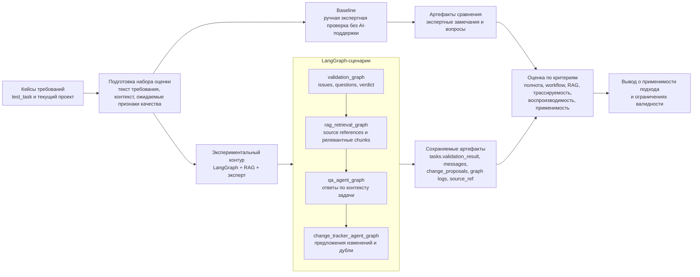


Рисунок 1.6 - схема методики оценки эффективности системы.

На рисунке 1.6 показано, что baseline и экспериментальный контур используют один и тот же набор требований. Это условие необходимо для корректного сравнения: различия в результатах должны объясняться способом обработки требования, а не разной сложностью исходных кейсов. При этом сравнение не обязательно должно завершаться единственным интегральным баллом. Более корректным для данного этапа является многокритериальное заключение, в котором отдельно описываются полнота выявленных проблем, качество вопросов, применимость найденного контекста, корректность workflow и трассируемость полученных артефактов.

Для фиксации результатов может использоваться таблица наблюдений по каждому требованию. В ней указывается исходный кейс, baseline-замечания, результат `validation_graph`, найденные RAG-источники, ответы QA Agent, предложения ChangeTracker Agent, экспертная оценка и ограничения конкретного запуска. Такая таблица позволяет отделить фактическое поведение системы от интерпретации исследователя. Она также облегчает повторную проверку: другой эксперт может открыть те же артефакты, сравнить их с текстом требования и подтвердить или оспорить выводы.

| Поле протокола оценки | Назначение |
| --- | --- |
| Идентификатор требования | Позволяет связать экспертную оценку с конкретной задачей и проектом |
| Тип сложности | Фиксирует, какие аспекты проверяются: критерии приемки, права, справочники, зависимости, ошибки, вложения |
| Baseline-замечания | Описывает результат ручной проверки без AI-поддержки |
| `tasks.validation_result` | Содержит issues, questions и verdict после выполнения `validation_graph` |
| RAG-источники | Показывает, какие chunks и source references были использованы |
| Чат и предложения | Фиксирует сообщения агента и записи в `change_proposals` |
| Экспертное заключение | Отражает полезность, полноту, ошибки и ограничения результата |

Ограничения валидности должны быть явно включены в методику, поскольку производственная практика не равна полномасштабному эксперименту. Во-первых, демонстрационные кейсы из `test_task` не являются статистически репрезентативной выборкой всех возможных требований. Они полезны для проверки применимости архитектуры, но недостаточны для вывода о среднем эффекте в разных командах и предметных областях. Во-вторых, экспертная оценка может зависеть от квалификации и опыта проверяющего, поэтому на следующем этапе желательно привлекать несколько экспертов или вводить согласованную инструкцию разметки. В-третьих, качество RAG зависит от полноты индекса, актуальности `indexed_at`, параметров chunking, embedding-модели и качества исходных документов. В-четвертых, Vision-сценарии допустимо рассматривать только как условную возможность: попадание `alt_text` изображений в RAG зависит от включенной Vision-обработки, размера файла и доступности провайдера.

Отдельно следует учитывать риск смешения результата системы и результата языковой модели. Если ответ выглядит содержательным, но не имеет source references или не связан с сохраненными артефактами проекта, он не должен рассматриваться как полноценное подтверждение эффективности RAG. Аналогично, если агент формулирует корректный вопрос, но этот вопрос не сохраняется и не влияет на дальнейший workflow, результат имеет ограниченную исследовательскую ценность. Поэтому в данной методике приоритет отдается проверяемым артефактам: состояниям задачи, `validation_result`, сообщениям, предложениям изменений, source references и журналам выполнения.

Итоговый вывод об эффективности системы должен формулироваться осторожно. По результатам производственной практики корректно говорить о применимости архитектурного подхода и о готовности системы к дальнейшей экспериментальной проверке. Если на выбранных кейсах система выявляет существенные пробелы требований, сохраняет результаты анализа, находит релевантный проектный контекст и позволяет эксперту проверить ход AI-сценария, это подтверждает прикладную состоятельность прототипа. Однако утверждения о количественном снижении времени анализа, росте полноты проверки или уменьшении числа ошибок допустимы только после отдельного эксперимента с baseline, размеченной выборкой и повторяемой процедурой измерения.

Таким образом, раздел 1.6 задает методологическую рамку для последующей главы оценки результатов. В первой главе методика определяет, что именно считается эффективностью, какие артефакты используются как данные наблюдения и какие ограничения необходимо учитывать. В третьей главе эти критерии могут быть применены к фактическим результатам практики: технической реализации, демонстрационным кейсам, сравнению с ручным процессом и анализу угроз валидности. Такая структура позволяет сохранить научную строгость магистерской работы и не смешивать проектирование системы с неподтвержденными заявлениями о ее результативности.

## 1.7 Итоговая структура решения

Итоговая структура решения обобщает проектные решения, рассмотренные в подразделах 1.1-1.6, и показывает, каким образом отдельные компоненты системы образуют единый прикладной контур поддержки требований. В рамках магистерской работы такая структура важна не только как техническая схема, но и как способ связать предметную область, модель данных, LangGraph-сценарии, RAG-память и методику оценки в одну проверяемую научно-техническую модель. Поэтому итоговый pipeline рассматривается как последовательность обработки требования, в которой каждый этап имеет собственный вход, сохраняемый артефакт и исследовательское назначение.

Начальной точкой pipeline является создание требования пользователем в frontend. На этом этапе требование существует как текстовая постановка, дополненная структурированными атрибутами: проектом, тегами, участниками, вложениями и начальным статусом workflow. Пользовательский интерфейс не выполняет самостоятельную интеллектуальную обработку требования; его роль состоит в том, чтобы предоставить участникам проекта управляемую форму ввода, редактирования, просмотра статуса, запуска проверки и дальнейшего обсуждения. Такое разделение снижает смешение пользовательского представления и прикладной логики: состояние требования фиксируется на серверной стороне и сохраняется в транзакционном хранилище.

После отправки формы backend сохраняет требование как задачу в PostgreSQL. Реляционная база данных выступает источником истины для статусов, связей, результатов проверки, сообщений, предложений изменений, аудита и журналов выполнения. Это принципиально для воспроизводимости: последующий анализ должен опираться не на разрозненные ответы модели, а на устойчивые записи, связанные с конкретной задачей, проектом и пользователем. На этом же уровне реализуется workflow, который задает допустимые переходы требования от черновика к проверке, доработке, ручному подтверждению, разработке, тестированию и завершению.

Следующим ключевым этапом является автоматическая проверка качества требования через `validation_graph`. Данный граф выполняет не произвольный prompt-вызов, а управляемый сценарий LangGraph с явными стадиями обработки. Он нормализует входные данные, применяет базовые критерии качества, учитывает проектные правила и при необходимости использует вопросы из проектного контекста. Результатом является структура `tasks.validation_result`, включающая замечания, уточняющие вопросы и verdict. Этот результат влияет на workflow: требование может перейти в `awaiting_approval` либо вернуться в `needs_rework`. Однако автоматический verdict не является окончательным управленческим решением. Перед передачей требования в разработку сохраняется обязательное ручное подтверждение аналитиком.

После проверки требование включается в контур проектной памяти. `rag_pipeline` формирует chunks из заголовка, описания, тегов, вложений и результата валидации, после чего подготовленные данные индексируются в Qdrant. Векторное хранилище не заменяет PostgreSQL и не становится источником истины о статусе задачи. Его назначение состоит в семантическом поиске релевантного контекста: похожих требований, ранее сформулированных вопросов и предложений изменений. Такое разделение позволяет одновременно сохранять транзакционную целостность данных и использовать накопленное знание проекта в LangGraph-сценариях.

Командное сопровождение требования выполняется через чат задачи. Пользовательские сообщения сохраняются в `messages`, после чего `chat_graph` определяет необходимость агентной обработки и маршрутизирует сообщение в соответствующий subgraph. Для вопросов по задаче используется `qa_agent_graph`, который формирует ответ с учетом текущей постановки, результата валидации и RAG-контекста. Для предложений корректировки используется `change_tracker_agent_graph`, преобразующий свободную реплику в нормализованное предложение изменения и проверяющий семантические дубли в `task_proposals`. Если сообщение не относится к предметным сценариям или запрошен неизвестный агент, используется fallback-логика `manager_agent_graph`. Таким образом, чат выступает не только средством коммуникации, но и интерфейсом к управляемым LangGraph-сценариям.

Управление изменениями выделено в отдельный участок pipeline. Предложения, полученные из обсуждения, сохраняются в `change_proposals` со статусами рассмотрения. Это позволяет отделить факт коммуникации от управляемого решения по изменению требования. В научном смысле данный механизм повышает трассируемость эволюции требования: можно установить, какое изменение было предложено, из какого сообщения оно возникло, было ли оно принято или отклонено и как оно повлияло на дальнейшую обработку задачи. При этом само принятие изменения остается действием пользователя, а не автономным решением AI-компонента.

Завершающая часть pipeline связана с ручным подтверждением, разработкой, тестированием и закрытием требования. После успешной автоматической проверки аналитик оценивает результат, при необходимости уточняет постановку и только затем переводит задачу в состояние готовности к разработке. Далее требование проходит статусы `ready_for_dev`, `in_progress`, `ready_for_testing`, `testing` и `done`. С точки зрения магистерской работы это показывает, что интеллектуальная поддержка встроена не вместо жизненного цикла разработки, а внутрь него: LangGraph и RAG помогают проверять, уточнять и сопровождать требование, но не отменяют ответственность участников проекта за принятие решений.

Итоговый pipeline обработки требования можно представить следующим образом:

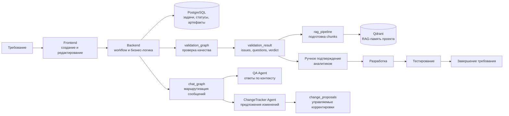

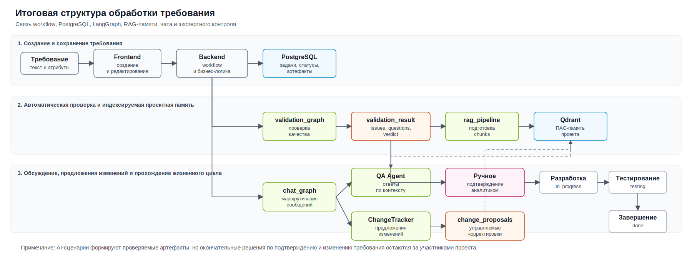

Рисунок 1.7 - итоговая структура обработки требования в магистерской системе.

На рисунке 1.7 показано, что система не сводится к одному модулю генерации текста. Она состоит из нескольких связанных контуров: транзакционного хранения, workflow, автоматической проверки, семантической памяти, агентной маршрутизации, управления изменениями и экспертного контроля. Каждый из этих контуров решает отдельную практическую задачу, но исследовательская ценность появляется именно при их объединении. Требование не только сохраняется как карточка, но и проверяется, индексируется, обсуждается, уточняется и проходит управляемый жизненный цикл.

Соответствие этапов итоговой структуры, программных компонентов и сохраняемых артефактов приведено в таблице.

| Этап решения | Основной компонент | Сохраняемый артефакт | Научно-практическое назначение |
| --- | --- | --- | --- |
| Создание и редактирование требования | Frontend, REST API | Запись в `tasks`, связи с проектом, тегами и участниками | Формализация требования как управляемого информационного объекта |
| Хранение состояния и workflow | FastAPI backend, PostgreSQL | Статус задачи, ответственные участники, audit events | Поддержка прослеживаемого жизненного цикла требования |
| Автоматическая проверка качества | `validation_graph` | `tasks.validation_result`: issues, questions, verdict | Выявление неполноты и неоднозначности постановки через управляемый LangGraph-сценарий |
| Индексация проектного контекста | `rag_pipeline`, Qdrant | Chunks в `task_knowledge`, `project_questions`, `task_proposals` | Сохранение и повторное использование проектного знания |
| Сопровождение вопросов в чате | `chat_graph`, `qa_agent_graph` | Agent messages, source references, возможные вопросы валидации | Поддержка поиска контекста и объяснимых ответов по требованию |
| Управление предложениями изменений | `change_tracker_agent_graph`, `ProposalService` | Записи в `change_proposals`, source references, признаки дублей | Трассируемое сопровождение эволюции требования |
| Ручное подтверждение | Backend workflow, роль аналитика | Переход в `ready_for_dev`, отметки подтверждения | Сохранение экспертного контроля над результатом автоматической проверки |
| Разработка и тестирование | Workflow статусов задачи | `in_progress`, `ready_for_testing`, `testing`, `done` | Связь качества постановки с последующей реализацией и проверкой результата |
| Наблюдаемость AI-сценариев | `LLMRuntimeService`, graph monitoring | `graph_run_logs`, `graph_run_events`, `llm_request_logs` | Воспроизводимость и анализ управляемости LangGraph- и LLM-вызовов |

Предложенная структура также задает границы ответственности AI-компонентов. `validation_graph` помогает предварительно проверить постановку, но не заменяет аналитика. `qa_agent_graph` предоставляет справочный ответ по текущему и найденному контексту, но не должен рассматриваться как независимый источник истины без source references. `change_tracker_agent_graph` нормализует предложения изменений, но не принимает решение об их применении. `LLMRuntimeService` централизует обращения к провайдерам, но качество ответа остается зависимым от модели, prompt-конфигурации, полноты контекста и параметров запуска. Поэтому итоговая система является не автономным агентом управления проектом, а инструментальной средой для поддержки экспертной работы с требованиями.

С позиции научной гипотезы магистерской работы итоговая структура демонстрирует, каким образом LangGraph и RAG могут быть включены в процесс управления требованиями без потери проверяемости. LangGraph обеспечивает явное описание сценариев, условных переходов и точек сохранения результата. RAG-память обеспечивает доступ к накопленному проектному контексту. PostgreSQL фиксирует каноническое состояние предметных сущностей. Workflow связывает результаты автоматической проверки с действиями участников проекта. В совокупности эти элементы создают основу для дальнейшей оценки: можно анализировать, какие замечания были сформированы, какой контекст найден, какие предложения изменений сохранены и как все это повлияло на прохождение требования по жизненному циклу.

Ограничения прототипа также сохраняются на уровне итоговой структуры. Производственная практика подтверждает применимость архитектурного подхода и готовность системы к апробации на демонстрационных кейсах, но не доказывает количественное повышение эффективности без отдельного эксперимента. Для статистически обоснованных выводов необходимы размеченный набор требований, baseline ручной проверки, повторяемая процедура сравнения и экспертная оценка результатов. Поэтому первая глава завершает не доказательство эффективности, а проектирование проверяемой системы, на основе которой во второй главе может быть описана реализация компонентов, а в третьей - выполнен анализ результатов практики и ограничений валидности.
