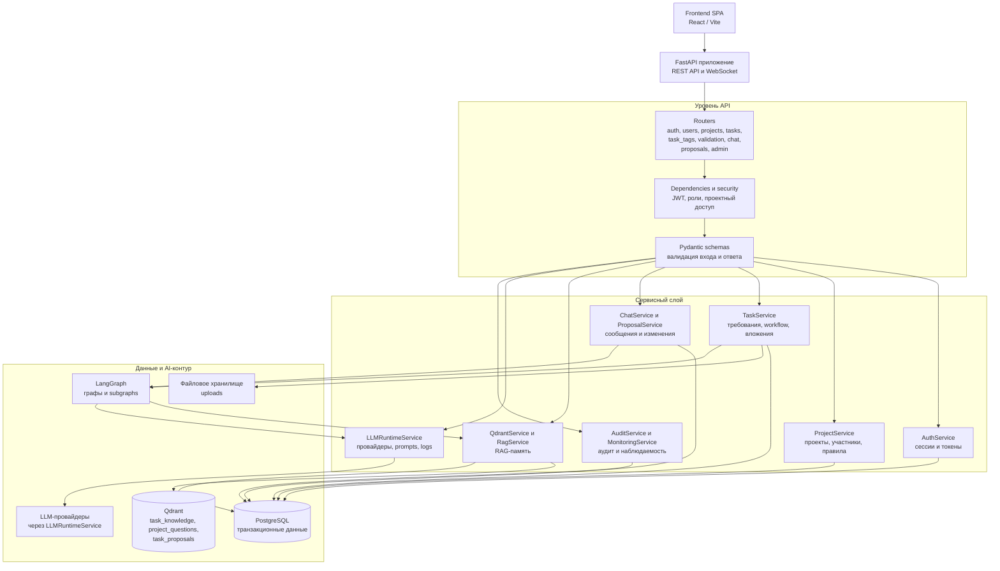
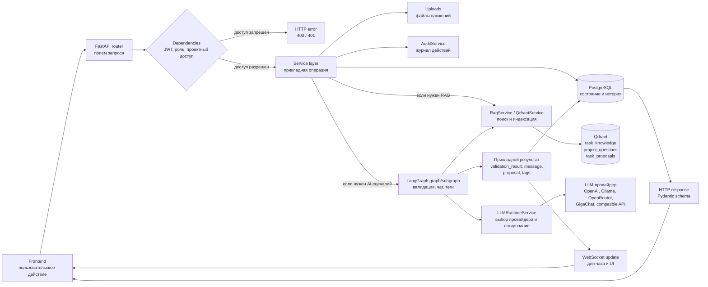

# 2. Реализация компонентов магистерской системы

## 2.1 Серверная часть

Серверная часть разрабатываемой системы реализует прикладное ядро магистерской работы. Ее назначение состоит не только в предоставлении HTTP-интерфейса для пользовательского приложения, но и в поддержании согласованного жизненного цикла требования, проверке прав доступа, фиксации действий участников, сохранении артефактов обсуждения и запуске управляемых AI-сценариев. В рамках исследования backend рассматривается как слой, связывающий предметную модель управления требованиями с транзакционным хранилищем, RAG-памятью проекта и агентной обработкой на LangGraph.

Такое положение серверной части принципиально для выбранной архитектуры. Пользовательский интерфейс отвечает за рабочее взаимодействие аналитика, разработчика, тестировщика, менеджера и администратора, однако именно backend определяет, какие операции допустимы для конкретного пользователя, в каком состоянии находится требование, какие данные должны быть сохранены в PostgreSQL, какой контекст должен быть синхронизирован с Qdrant и какой LangGraph-сценарий должен быть запущен. Поэтому серверная часть выступает не как технический промежуточный слой, а как формализованный механизм управления состоянием магистерской системы.

Технологической основой backend является FastAPI. Данный фреймворк используется для описания REST API, WebSocket-взаимодействия, подключения зависимостей, обработки схем входных и выходных данных и публикации служебных endpoint. Асинхронная модель выполнения соответствует характеру системы: сервер одновременно обслуживает пользовательские запросы, обращения к PostgreSQL, операции с Qdrant, работу с файлами вложений и запуск сценариев интеллектуальной обработки. Запуск приложения выполняется через ASGI-entrypoint `backend/main.py`, где создается объект FastAPI с названием "Интеллектуальная платформа управления задачами", подключаются CORS-настройки, роутеры, статическая раздача вложений и экспортированные схемы LangGraph.

Работа с транзакционными данными построена на SQLAlchemy AsyncIO. PostgreSQL используется как источник истины для пользователей, refresh-сессий, проектов, участников, требований, вложений, сообщений, предложений изменений, вопросов валидации, справочников тегов, аудита, настроек LLM runtime и журналов выполнения. Структура базы данных развивается через Alembic-миграции. Это позволяет фиксировать изменение схемы данных как воспроизводимый инженерный процесс, что важно для магистерской работы: состояние прототипа должно быть не только реализовано, но и проверяемо восстановлено в другой среде.

Pydantic v2 используется как слой строгого описания входных и выходных данных. Схемы из `backend/app/schemas` отделяют внешнее представление API от SQLAlchemy-моделей. Такое разделение снижает связанность между внутренней моделью хранения и контрактами, которые использует frontend. Кроме того, Pydantic-схемы позволяют явно задавать ограничения формата, типы полей и структуру ответов, что повышает воспроизводимость прикладных сценариев и уменьшает вероятность неявной передачи некорректных данных между слоями системы.

### Структура серверного приложения

Код backend организован по слоям. Каталог `backend/app/routers` содержит FastAPI-роутеры, которые принимают HTTP- и WebSocket-запросы, выполняют первичную привязку параметров и вызывают прикладные сервисы. Каталог `backend/app/core` содержит конфигурацию, подключение к базе данных, механизмы безопасности и зависимости. Каталог `backend/app/models` содержит SQLAlchemy-модели, `backend/app/schemas` - Pydantic-схемы, `backend/app/services` - бизнес-логику и интеграционные операции, а `backend/app/agents` - LangGraph-графы, subgraphs, RAG pipeline и механизмы экспорта схем.

Такое разделение необходимо для управляемости системы. Роутер не должен содержать сложную доменную логику и тем более не должен напрямую обращаться к LLM-провайдеру. Его задача состоит в том, чтобы принять запрос, проверить доступ через зависимости и передать выполнение в сервисный слой. Сервис, в свою очередь, работает с транзакционными сущностями, запускает индексацию, инициирует LangGraph-сценарий или сохраняет результат выполнения. Благодаря этому интеллектуальная обработка остается встроенной в жизненный цикл требования, но не смешивается с транспортным уровнем API.



Рисунок 2.1 - слоистая структура серверной части магистерской системы.

На уровне запуска приложения backend выполняет несколько системных действий. При старте создается каталог для вложений, проверяются и создаются Qdrant-коллекции, а также экспортируются изображения LangGraph-схем в каталог `LANGGRAPH_IMAGES_DIR`. Эти операции имеют прикладное значение: вложения являются частью требования, Qdrant-коллекции необходимы для RAG-памяти, а экспорт схем позволяет визуально контролировать структуру agentic-сценариев.

Сервер публикует два служебных endpoint. `GET /healthz` показывает, что процесс приложения отвечает на запросы. `GET /readyz` дополнительно проверяет готовность работы с PostgreSQL и поэтому используется как readiness endpoint. Также приложение раздает вложения через `/uploads` и `/api/uploads`, а экспортированные схемы LangGraph через `/langgraph-images` и `/api/langgraph-images`. Эти статические пути не изменяют бизнес-логику, но обеспечивают доступ к артефактам, необходимым для пользовательских сценариев и анализа архитектуры.

### Группы API и их назначение

Backend API сгруппирован по доменным областям. Такое группирование соответствует предметной модели системы: отдельные роутеры отвечают за аутентификацию, пользователей, проекты, требования, чат, предложения изменений, справочники и административные функции. В отчете важно фиксировать не только перечень endpoint, но и исследовательский смысл этих групп: каждая из них поддерживает часть жизненного цикла требования или часть наблюдаемости системы.

| API-группа | Назначение в серверной части |
| --- | --- |
| `auth` | Регистрация, вход, refresh, logout, получение текущего пользователя и управление refresh-сессиями |
| `users` | Работа с пользователями, профилем, avatar и административным обновлением учетных записей |
| `projects` | Управление проектами, участниками проекта и проектными правилами проверки требований |
| `tasks` | CRUD требований, workflow-переходы, вложения, фиксация изменений и AI-подсказка тегов |
| `task_tags` | Управление справочником тегов, доступных в рамках конкретного проекта |
| `validation` | Запуск автоматической проверки требования через `validation_graph` |
| `chat` | История сообщений, отправка сообщений, WebSocket-обновления и запуск agent routing |
| `proposals` | Получение, принятие и отклонение предложений изменений требования |
| `admin` | LLM-провайдеры, prompt configs, Qdrant, мониторинг, audit feed, пользователи, теги и вопросы валидации |
| System endpoints | `/healthz`, `/readyz`, `/uploads`, `/langgraph-images` для проверки состояния и доступа к артефактам |

Для магистерской работы такая структура API показывает, что серверная часть охватывает не только базовое хранение карточек задач. Она реализует полный контур сопровождения требования: от создания постановки и назначения участников до проверки качества, обсуждения, фиксации предложений изменений, передачи в разработку, тестирования и анализа системных событий.

### Аутентификация, авторизация и управление доступом

Безопасность backend строится на сочетании access token и refresh token. Access token используется для авторизации прикладных запросов и передается клиентом при обращении к защищенным endpoint. Refresh token хранится в `httpOnly` cookie, что снижает риск доступа к нему из JavaScript-кода frontend. Refresh-сессии фиксируются в PostgreSQL, поддерживают ротацию и отзыв. Такой подход позволяет отделить краткоживущий токен доступа от более долгой сессии восстановления и обеспечивает управляемость пользовательских сессий.

В системе используется ролевая модель. Глобальные роли `ADMIN`, `ANALYST`, `DEVELOPER`, `TESTER` и `MANAGER` определяют общий класс доступных действий. При этом проектное участие хранится отдельно от глобальной роли. Это важно для предметной области: один пользователь может иметь системную роль, но его операции внутри конкретного проекта должны зависеть от участия в этом проекте и от назначений в задаче. Поэтому проверки доступа реализуются через зависимости backend и сервисный слой, а не только через условное отображение кнопок во frontend.

Роль `ADMIN` используется для административных сценариев: управления пользователями, справочниками, LLM runtime, prompt-конфигурациями, Qdrant и мониторингом. `ANALYST` отвечает за подготовку и подтверждение требований. `DEVELOPER` и `TESTER` работают с последующими стадиями жизненного цикла задачи. `MANAGER` участвует в управленческих сценариях и контроле состояния проекта. Разграничение ролей необходимо для воспроизводимости workflow: переходы требования должны быть следствием проверенных действий участников, а не произвольной модификацией статуса.

### Сервисный слой и бизнес-логика

Сервисный слой является основным местом прикладной логики. Он отделяет транспортный уровень FastAPI от операций над предметными сущностями, интеграции с векторным хранилищем и запуска LangGraph. Такое решение повышает сопровождаемость: изменение workflow, правил сохранения сообщений, индексации или LLM runtime не требует переноса логики в роутеры.

`AuthService` управляет паролями, access/refresh tokens и пользовательскими сессиями. `ProjectService` отвечает за проекты, участников и проектные правила. `TaskService` реализует операции над требованиями, загрузку вложений, workflow-переходы, фиксацию изменений и признаки необходимости повторной проверки. `ChatService` сохраняет сообщения и запускает обработку через LangGraph-сценарии, а `ChatRealtimeService` публикует обновления через WebSocket. `ProposalService` управляет предложениями изменений, отделяя обсуждение от формального решения о корректировке требования.

`ValidationQuestionService` поддерживает банк вопросов валидации, используемых для проверки полноты постановки и повторного применения проектного знания. `TaskTagService` управляет справочником тегов. `QdrantService` и `RagService` обслуживают RAG-контур: обеспечивают наличие коллекций, подготовку и поиск контекста. `LLMRuntimeService` централизует обращение к LLM-провайдерам, учитывая default provider, agent overrides, prompt configs, параметры модели и журналирование запросов. `AuditService`, `MonitoringService`, `AdminQdrantService` и `AdminLLMService` поддерживают наблюдаемость и административные операции.

С научной точки зрения сервисный слой фиксирует границу между детерминированной бизнес-логикой и вероятностной AI-обработкой. Создание задачи, проверка прав, сохранение сообщения, изменение статуса, запись в аудит и обновление индекса являются детерминированными операциями. Формирование ответа агента, извлечение предложения изменения или генерация выводов по требованию могут зависеть от LLM. Разделение этих областей позволяет описывать систему как управляемую, а не как набор неявных prompt-вызовов.

### Хранение данных и миграции

PostgreSQL используется для хранения канонического состояния системы. В нем фиксируются сущности, требующие транзакционной целостности: учетные записи, проекты, участники, требования, вложения, сообщения, предложения изменений, вопросы валидации, справочники, аудит, настройки LLM runtime и журналы выполнения. Это хранилище отвечает на вопрос о фактическом состоянии требования: кто его создал, кто назначен ответственным, какой статус установлен, какой результат проверки сохранен, какие сообщения и предложения изменений связаны с задачей.

Миграции Alembic обеспечивают контролируемое развитие схемы. В рамках магистерской системы это важно по двум причинам. Во-первых, модель данных постепенно расширяется по мере добавления workflow, RAG, мониторинга и LLM runtime. Во-вторых, любой этап реализации должен быть воспроизводим: структура таблиц, связей и индексов не должна зависеть от ручной настройки базы данных. Поэтому миграции выступают частью инженерной проверяемости результата практики.

Файловые вложения хранятся в `UPLOAD_DIR`, а в базе сохраняются метаданные вложения: имя файла, MIME-тип, путь хранения и при наличии `alt_text`. Такое разделение позволяет не помещать бинарное содержимое непосредственно в транзакционную модель, но сохранять связь файла с требованием и использовать его как источник контекста для RAG. Vision-описания изображений следует рассматривать как условную возможность, зависящую от настроек `RAG_VISION_ENABLED`, ограничений размера и доступного провайдера. Поэтому серверная часть не должна описываться как гарантированно мультимодальная во всех режимах запуска.

### Workflow требования

Одной из ключевых функций backend является управление жизненным циклом требования. В текущей реализации используется последовательность статусов:

```text
draft -> validating -> needs_rework / awaiting_approval -> ready_for_dev -> in_progress -> ready_for_testing -> testing -> done
```

Статус `draft` соответствует подготовке постановки. Переход в `validating` означает запуск автоматической проверки через LangGraph. После завершения `validation_graph` возможны два результата: `needs_rework`, если требование требует уточнения, или `awaiting_approval`, если автоматическая проверка сформировала положительный verdict. При этом автоматический результат не является окончательным решением о готовности требования. Перед передачей в разработку требуется ручное подтверждение, после чего задача переходит в `ready_for_dev`, затем в `in_progress`, `ready_for_testing`, `testing` и `done`.

Такой workflow отражает исследовательскую позицию работы: AI-поддержка используется как инструмент предварительного анализа и выявления проблем, но не заменяет ответственного участника проекта. Backend обеспечивает это ограничение технически. Он хранит результат проверки в `tasks.validation_result`, фиксирует ручное подтверждение, управляет переходами и не сводит жизненный цикл требования к одному автоматическому выводу модели.

### Интеграция с LangGraph, RAG и LLM runtime

Все AI-взаимодействие в системе реализуется через LangGraph. Это означает, что backend не должен формировать произвольный prompt непосредственно в роутере и отправлять его выбранному провайдеру. Вместо этого прикладной сценарий оформляется как граф или subgraph с явным состоянием, узлами обработки и переходами. Такой подход повышает управляемость и позволяет анализировать не только итоговый текст ответа, но и маршрут обработки.

К основным графам относятся `validation_graph`, `chat_graph`, `qa_agent_graph`, `change_tracker_agent_graph`, `manager_agent_graph`, `task_tag_suggestion_graph`, `provider_test_graph`, `vision_test_graph` и `attachment_vision_graph`. `validation_graph` используется для проверки качества требования. `chat_graph` маршрутизирует сообщения чата. `qa_agent_graph` отвечает на вопросы по задаче, `change_tracker_agent_graph` выделяет предложения изменений, а `manager_agent_graph` используется как fallback и механизм forced routing. Детальное описание этих сценариев целесообразно раскрывать в разделах 2.3 и 2.4, а в разделе 2.1 важно зафиксировать серверный принцип их запуска.

RAG-контур опирается на Qdrant и использует три коллекции: `task_knowledge`, `project_questions` и `task_proposals`. Коллекция `task_knowledge` хранит контекст задач, фрагменты описаний, результаты валидации, теги и данные вложений. `project_questions` используется для вопросов валидации, которые могут повторно применяться в проектном контексте. `task_proposals` хранит предложения изменений и помогает искать дубли. PostgreSQL при этом остается источником истины, а Qdrant выполняет роль семантической памяти и механизма поиска релевантного контекста.

`LLMRuntimeService` скрывает различия между провайдерами и централизует модельные вызовы. Он учитывает настройки активного провайдера, default provider, agent overrides, prompt configs, модель, параметры генерации и журналирование. Благодаря этому графы и сервисы не привязываются напрямую к OpenAI, Ollama, OpenRouter, GigaChat или OpenAI-compatible API. Для магистерской работы это важно как механизм гибкости: можно изменять провайдера и параметры выполнения, не меняя доменную бизнес-логику и структуру LangGraph-сценариев.



Рисунок 2.2 - обобщенный поток обработки серверного запроса.

Диаграмма показывает, что путь запроса зависит от прикладного сценария. Обычная операция управления проектом или задачей может завершиться чтением и записью в PostgreSQL. Операция, связанная с поиском контекста, дополнительно обращается к Qdrant. Операция, содержащая AI-обработку, запускает LangGraph-граф, который при необходимости использует RAG и обращается к LLM только через `LLMRuntimeService`. Такой поток обеспечивает контролируемое включение интеллектуального слоя в серверную обработку.

### Наблюдаемость и проверяемость

Для магистерской работы важно не только реализовать функциональность, но и обеспечить возможность анализа полученных результатов. Backend содержит несколько механизмов наблюдаемости. `audit_events` фиксируют действия пользователей и системные события. `graph_run_logs` и `graph_run_events` позволяют отслеживать выполнение LangGraph-графов и отдельных узлов. `llm_request_logs` сохраняют сведения о LLM-запросах, задержках, ошибках и параметрах выполнения. Административные API предоставляют доступ к мониторингу, Qdrant overview, LLM request logs, настройкам провайдеров, prompt configs и вопросам валидации.

Наличие этих механизмов поддерживает исследовательскую проверяемость. Можно анализировать, какие требования проходили проверку, какие вопросы были сформированы, какие сообщения привели к предложениям изменений, какой граф был запущен и какой провайдер использовался для модельного вызова. Это отличает систему от неформального использования LLM в переписке: результаты AI-сценариев становятся частью наблюдаемого процесса, связанного с задачей, пользователем, проектом и состоянием базы данных.

Качество backend проверяется с помощью статического анализа и тестов. В проекте предусмотрены `ruff`, `mypy` и `pytest`, а также Makefile-команды для запуска backend-проверок. Тесты покрывают API, сервисы, безопасность, Qdrant-сервисы, RAG pipeline, LangGraph-графы, мониторинг, routing чата и административные сценарии. Для отчета это означает, что серверная часть описывается не только как реализованный компонент, но и как проверяемая часть магистерской системы.

Таким образом, серверная часть выполняет роль прикладного ядра, в котором объединены управление доступом, транзакционное хранение данных, workflow требования, обработка вложений, RAG-память, LangGraph-сценарии, LLM runtime и наблюдаемость. Такое устройство соответствует исследовательской задаче магистерской работы: изучить, как управляемая AI-поддержка может быть встроена в процесс анализа и сопровождения требований без потери контроля над состоянием, правами, источниками данных и результатами обработки.
